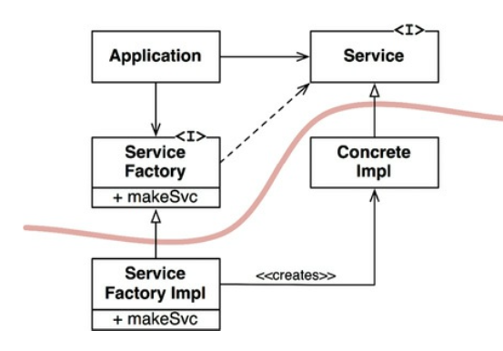

# Software Design Principle

- 소프트웨어 디자인 원칙은 SOLID라고 불리며 Robert C.Martin이 주창한 원칙이다.
- 이는 (SRP, OCP, LSP, ISP, DIP)의 앞글자를 따서 SOLID라고 부른다. 
- 디자인 원칙은 견고하고, 확장성이 있으며, 신뢰성, 유지보수성이 뛰어난 어플리케이션을 구현하기 위한 훌륭한 원칙이다. 

## SRP(Single Responsibility Principle)

- SRP(Single Responsibility Principle)는 소프트웨어 디자인 원칙으로 단일 책임 원칙으로 해석된다.
- 클래스나 모듈은 단 하나의 책임만을 가져야 한다는 것을 의미한다. 
- 모듈의 응집도를 높이고 결합도를 낮추어 유지보수와 확장이 쉬운 구조를 유지할 수 있다.
- 책임: 
  - 특정 사용자의 요청을 처리해야하는 책임으로 이해

<br/>

- clean architecture 에서 단일책임 원칙 정의
  - ```A module should have one, and only one, reason to change.``` 
    - 모듈은 변경되어야 할 오직 한가지의 변경 사유만 있어야한다.
  - ```A module should be responsible to one, and only one, user or stakeholder.``` 
    - 모듈은 사용자 혹은 스테이크홀더(이해관계자)에게만 책임을 져야한다.
  - ```A module should be responsible to one, and only one, actor.```
    - 모듈은 오직 하나의 액터에 의해서만 책임을 저야한다. 
- 응집도라는 용어는 SRP를 포함한다. 즉, 단일 액터만을 책임지기 위해서 서로 응집되어 있어야한다. 
- 콘웨이의 법칙 생각해보기
  - 콘웨이는 ```소프트웨어 아키텍처는 조직의 의사소통 구조에 따라 결정된다.``` 라고 했다. 
  - 조직의 사회적 구조에 따라 소프트웨어 아키텍처가 영향을 받기 때문에, 각 모듈 혹은 서비스는 변경해야할 단 하나의 이유를 가진다. 
### 단일 책임 원칙을 위배한 예제

- 골프연습장 멤버에 대한 아키텍팅을 수행하고자 하는 경우를 가정해보자.

```java
class Member {
  String name;
  Integer age;
  String joinDate;

  String getName() {...}
  Integer getAge() {...}
  ...
  
  Integer getUseBallCount() {...}
  List<Score> getGameScores() {...}
}
```

- 위 케이스는 회원과 회원의 활동 정보가 동일한 클래스 내에 존재 
- 회원의 가입정보, 회원의 활동정보가 서로다른 액터의 책임을 공동으로 가지고 있음

<br/>

### 솔루션 

```java
class Member {
  String name;
  Integer age;
  String joinDate;

  String getName() {...}
  Integer getAge() {...}
  ...
}

class MemberPracticesAnalizer {
  Member member;

  Integer getUseBallCount() {...}
  SwingPath getSwingPathLog() {...}
}

class MemberGameAnalizer {
  Member member;

  List<Score> getGameScores() {...}
}
```

- 위 클래스는 멤버, 연습 분석기, 게임분석기 3개의 클로스로 분리하여 SRP를 준수한다. 
- Member 클래스는 회원 정보만을 관리한다. 
- MemberPracticesAnalizer 클래스는 멤버가 수행한 연습 정보를 저장/조회/분석한다. 
- MemberGameAnalizer 클래스는 멤버가 수행한 게임 기록을 관리한다. 
- 각각 클래스는 액터의 요청에 따라 책임을 분리하였다. 

<br/>

### 솔루션 2: 통합된 정보를 한번에 관리가 필요한경우

```java
class MemberFacade {
  Member getMembeById() {}
  Integer getUseBallCountByMemberId(Long id) {}
  SwingPath getSwingPathLogByMemberId(Long id) {}
  List<Score> getGameScoresByMemberAndGameId(Long id, Long gameNo) {}
}
```

- SRP를 지키다 보면 책임으로 분리된 여러 클래스를 조합해서 결과를 반환하거나 액션을 수행해야할 수 있다. 
- 이 경우 Facade 패턴으로 이러한 문제를 해결하면서도 SRP를 지킬 수 있다. 
- ```Facade```는 프랑스 어로 ```대문``` 이라는 의미이며 액터에게 내부 구현은 감추고, 수행가능한 인터페이스만 열어주는 기능을 수행한다. 

### SRP 베스트프랙티스

- 1. 클래스의 크기를 작게 유지하기
  - 클래스가 담당하는 책임이 많을수록 코드가 복잡해지고 유지보수성이 떨어진다. 
  - 따라서 클래스의 크기를 작게 유지하고, 각 클래스는 특정한 기능에만 집중하도록 설계하는 것이 좋다.
- 2. 인터페이스와 추상화를 활용하기
  - 인터페이스와 추상화를 사용하면, 클래스의 구현과 인터페이스를 분리할 수 있어 책임이 분리된다. 
  - 이를 통해 클래스는 자신이 담당하는 책임에만 집중할 수 있다.
- 3. 단일 책임 클래스를 사용하기
  - 단일 책임 클래스는 오직 하나의 책임만을 갖도록 설계된 클래스이다. 
  - 이를 사용하면 클래스가 담당하는 책임이 분명해지고, 클래스 간의 의존성이 낮아져 결합도가 낮아진다.
- 4. 테스트 가능한 코드 작성하기
  - SRP를 따르면 모듈의 응집도가 높아지므로, 모듈을 테스트하기 쉬워진다. 
  - 따라서 SRP를 따르면 테스트 가능한 코드를 작성할 수 있다.
  - 다시 단일 책임원칙을 따르지 않으면 테스트가 쉽게 깨지고, 이를 재작성하기 위한 방법역시 복잡해진다, 그러므로 테스트코드를 통한 단일 책임원칙 접근법도 좋은 방법이다.

### SRP(Single Responsibility Principle)의 주요 장점

#### 높은 응집성

- 응집도(Cohesion)는 책임 즉 동일한 책임을 수행하는 데이터와 기능을 하나로 묶어주는 것
- SRP는 클래스와 메소드에 단일 책임을 할당하므로 응집성을 높일 수 있다. 
- 각 클래스와 메소드가 한 가지 기능만 담당하면 클래스와 메소드 내부의 코드는 연관성이 높아지며, 서로 다른 기능을 가진 코드가 뒤섞이지 않아 코드의 가독성과 유지보수성이 향상된다.

#### 낮은 결합도

- 결합도(Coupling)는 하나의 기능이 여러가지 일을 수행하는 정도를 나타낸다. 
- 이때 여러가지 일이란 것은 단일책임영역에 속하지 않는 다른 영역의 일역시 여기저기서 수행하여, 특정 코드의 변경에 따른 사이드 이펙트가 높아지는 현상을 야기한다. 
- SRP는 코드를 책임에 따라 나누기 때문에 클래스와 메소드 간의 결합도가 낮아진다. 
- 즉, 하나의 클래스나 메소드를 변경할 때 다른 클래스와 메소드에 영향을 미치지 않는다. 
- 이는 유연한 코드를 작성할 수 있게 한다.

#### 코드의 재사용성

- SRP는 클래스와 메소드에 책임을 분배하므로 코드의 재사용성이 높아진다. 
- 즉, 단일 책임 원칙을 따르는 클래스와 메소드는 다른 프로젝트에서도 재사용될 수 있다.

#### 유지보수성

- SRP는 코드를 작은 단위로 쪼개서 구현하므로 유지보수성이 높아진다. 
- 각 클래스와 메소드는 명확한 책임을 가지므로 코드 변경이 필요한 경우 해당 책임만 수정하면 된다. 
- 이는 다른 기능에 대한 영향을 최소화하면서 코드를 변경할 수 있게 해준다.

<br/>

- 따라서 SRP를 따르면 코드의 가독성, 유지보수성, 재사용성, 유연성 등이 향상되며, 코드의 결합도와 복잡도를 줄일 수 있다.
- 이는 클래스 설계 뿐만 아니라, 마이크로 서비스, 서비스 기반 아키텍처 등에서도 SRP는 매우 중요한 설계 원칙이다. 

-------------------------

## OCP(Open Close Principle)

- OCP(Open-Closed Principle)는 소프트웨어 디자인 원칙 중 하나로 개방-폐쇄 원칙이라고 한다., 
- 1988년 Bertrand Meyer이 주창한 원칙이다. 
- ```A software artifact should be open for extension but closed for modification.``` 
  - 소프트웨어 요소(클래스, 모듈, 함수 등)는 확장에는 열려 있어야 하고 변경에는 닫혀 있어야 한다는 것을 의미한다. 
- 확장: 
  - 어플리케이션의 기능을 추가하는 것
  - 열린다는 개념: 기능을 추가하여도 기존 시스템에 영향을 주지 않는다. 
- 변경: 
  - 존재하는 기능의 변경을 수행하는 것
  - 닫혀있다는 개념: 변경이 발생하여도 참조하는 기능이나 어플리케이션에 영향을 주게 된다. 가능하면 변경보다는 확장을 하도록 해야한다.
- 이를 통해 유지보수성과 재사용성을 높일 수 있다.
- 클래스나 메소드에 적용이 되지만, 소프트웨어 아키텍처 컴포넌트 레벨이나, 서비스 레벨에도 적용된다. 

### OCP 원칙을 위배한 예제

```java
class Pet{
  String petType;
  void speak() {
    if ("Dog".equals(petType)) {
      System.out.println("Bark");
    } else if ("Cat".equals(petType)) {
      System.out.println("Miou");
    }
  }
}
```

- Pet 클래스에서 petType에 따라 speak() 함수에서 조건식을 검사하고 있다. 
- 이경우 새로운 Pet이 추가되면 관련 조건문 전체를 수정해야하며, 누락되거나 이를통해 사이드 이펙이 발생할 가능성이 높아진다. 

### 솔루션 

```java
interface Pet {
  void speak();
}

class Cat implements Pet {
  void speak() {
    System.out.println("Miou");
  }
}

class Dog implements Pet {
  void speak() {
    System.out.println("Bark");
  }
}

class SuperDog extends Dog {
  @Override
  void speak() {
    System.out.println("Bark! Bark! Bark! Bark! Bark! Bark! Bark!");
  }
}

class GroomingPet {
  void grooming(List<Pet> pets) {
    for (Pet pet in pets) {
      pet.speak();
    }
  }
}
```

- 위 코드 패턴은 새로운 종류의 Pet이 필요한경우, Pet을 구현한 class를 추가하기만 하면 되므로 확장에 열려있다.
- grooming에 어떠한 변경도 발생하지 않으며, 사이드 이펙도 발생하지 않는다. 변경에는 닫혀있다. 
- 특히 SuperDog과 같이 기존 클래스를 상속 받는 경우에도 메소드 오버라이딩을 통해서 확장이 가능하다. 

### OCP 베스트프랙티스

- 1. 추상화를 사용하기
  - 추상화를 사용하면, 소프트웨어 요소의 변화에 대응하기 쉬워진다.
  - 추상화를 통해 기능을 추상화하고, 인터페이스를 사용하여 각 기능을 분리하면, 새로운 기능을 추가하거나 기존 기능을 수정해도 다른 기능에 영향을 미치지 않는다.
  - 즉, 내부의 변경으로 인해 연관된 타 요소에 영향을 미치지 않도록 구성하는 것이 핵심이다.
- 2. 다형성을 사용하기
  - 다형성은 OCP를 구현하는 데 중요한 개념이다.
  - 다형성을 사용하면, 인터페이스를 구현한 다양한 클래스가 있을 때, 클라이언트 코드는 인터페이스에만 의존하여 변경에 유연하게 대응할 수 있다.
- 3. 팩토리 패턴을 사용하기
  - 팩토리 패턴은 객체 생성을 추상화하여, 클라이언트 코드가 구체적인 객체 생성을 알 필요가 없도록 해준다. 
  - 이를 통해 새로운 객체를 추가하거나 기존 객체를 수정해도 클라이언트 코드를 변경하지 않아도 되므로 OCP를 구현하기에 좋다.
- 4. 의존성 주입(Dependency Injection)을 사용하기
  - 의존성 주입은 객체간의 의존성을 줄이고 유연한 소프트웨어를 만드는데 중요한 이다. 
  - 의존성 주입을 사용하면, 객체를 생성하는 책임을 클라이언트에서 분리하여 객체 생성에 대한 제어를 바깥에서 할 수 있다. 
  - 이를 통해 새로운 객체를 추가하거나 기존 객체를 수정해도 클라이언트 코드를 변경하지 않아도 되므로 OCP를 구현하기에 좋다.

### OCP의 장점 

- 확장성: 
  - 새로운 기능이나 요구 사항이 추가되어도 기존 코드를 수정할 필요 없이, 기존 코드를 확장하여 새로운 동작을 추가할 수 있다. 
  - 이는 코드의 재사용성과 유지 보수성을 높여준다.
- 안정성: 
  - 변경으로 인한 파급 효과를 줄일 수 있다. 
  - 변경에 따른 영향을 최소화하여 시스템의 안정성을 유지할 수 있다.
- 유연성: 
  - 기존 코드를 수정하지 않아도 새로운 동작을 추가할 수 있으므로, 시스템의 유연성이 높아진다. 
  - 새로운 기능이나 요구 사항이 추가될 때, 기존 코드를 수정하지 않아도 되므로 시스템의 대응력이 높아진다.
- 단순성:
  - 개방-폐쇄 원칙이 지켜지므로, 코드의 복잡도를 낮출 수 있다. 
  - 새로운 요구 사항이나 기능이 추가될 때마다 코드를 수정하는 것이 아니므로, 코드의 복잡도가 낮아져 가독성과 이해성이 높아진다.

-------------------------

## LSP(Liskov Substitution Principle)

- LSP(Liskov Substitution Principle)는 소프트웨어 디자인 원칙 중 하나로, 리스코프 치환원칙이라고 한다.
- 이는 하위 클래스는 상위 클래스의 대체 가능성을 보장해야 한다는 것을 의미한다. 
- 즉, 상위 클래스의 기능을 하위 클래스에서 모두 수행할 수 있어야 한다는 것이다.

```text
What is wanted here is something like the following substitution property: If for each object o1 of type S there is an object o2 of type T such that for all programs P defined in terms of T, the behavior of P is unchanged when o1 is substituted for o2 then S is a subtype of T
```

- 여기서 원하는 것은 다음 대체 속성을 따르는 것이다. 
- 만약 타입 S의 o1 객체가 있고, 타입 T의 o2 객체가 있다면, 다음 T를 사용하는 모든 프로그램 P에 대해서, o1이 o2로 대체되고, S가 T의 서브 타입일때 P의 행위는 변경되지 않는다는 것이다.

### LSP를 위배하는 예제

- Rectangle.java 클래스 
  
```java
public class Rectangle {
    protected double width;
    protected double height;

    public double getWidth() {
        return width;
    }

    public void setWidth(final double width) {
        this.width = width;
    }

    public double getHeight() {
        return height;
    }

    public void setHeight(final double height) {
        this.height = height;
    }

    public double calcArea() {
        return width * height;
    }
}
```

- 사각형의 속성 (넓이/높이)과 넓이를 구할 수 있는 Rectangle 객체를 생성하였다. 

<br/>

- Square.java 클래스 
  
```java
public class Square extends Rectangle {
    @Override
    public void setWidth(final double width) {
        this.height = width;
        this.width = width;
    }

    @Override
    public void setHeight(final double height) {
        this.height = height;
        this.width = height;
    }
}
```

- 정사각형은 넓이와 높이가 같으므로 width/height 를 세팅할때 두 값을 동일하게 맞춰주어 조건을 만족시킨다. 
- Square(자식)은 Rectangle(부모) 을 상속받아서 사용하므로 Square는 나머지 부모 객체의 모든 메소드를 그대로 대체할 수 있다.

<br/>

- 테스트코드 
  
```java
      {
        Rectangle rectangle = new Rectangle();
        rectangle.setHeight(4);
        rectangle.setWidth(5);
        assertThat(rectangle.calcArea()).isEqualTo(20);
      }
      ...
      {
        Rectangle rectangle = new Square(); 
        rectangle.setHeight(4);
        rectangle.setWidth(5);
        assertThat(rectangle.calcArea()).isEqualTo(20);
      }
```

- 테스트코드로 확인하기 
- Rectangle 인스턴스는 정상적으로 ```4 * 5 = 20``` 으로 정상값을 출력하고 있다. 
- Square 인스턴스는 Square(자식) 의 관점에서는 높이와 넓이가 같으므로 최종값은 25가 되는 것이다. 
- 그러나 Rectangle 로 치환이 되었을때 우리가 원하는 값은 ```4 * 5 = 20``` 을 원하는 것이므로 LSP를 위반하고 있다. 

### 솔루션

- 위를 해결하기 위해서는 다음과 같이 Area를 계산하는 별도의 클래스를 작성하거나, 상속을 사용하지 않는 방법으로 해결할 수 있다. 

- Polygon.java
  
```java
interface Polygon {
  double calcArea();
}
```

<br/>

- Rectangle.java

```java
public class Rectangle implements Polygon{
    protected double width;
    protected double height;

    public double getWidth() {
        return width;
    }

    public void setWidth(final double width) {
        this.width = width;
    }

    public double getHeight() {
        return height;
    }

    public void setHeight(final double height) {
        this.height = height;
    }
    
    public double calcArea() {
        return width * height;
    }
}
```

- Polygon 에서 calcArea() 영역만 구현하고 있다.
- 이를 통해 직사각형의 넓이에 대한 올바른 결과를 획득할 수 있다. 

<br/>

- Square.java
  
```java
public class Square implements Polyon {
    protected double width;
    protected double height;

    ...

    @Override
    public void setWidth(final double width) {
        this.height = width;
        this.width = width;
    }

    @Override
    public void setHeight(final double height) {
        this.height = height;
        this.width = height;
    }
}
```

- Square는 더이상 Rectangle 의 자식이 아니다. 그러나 Polygon 의 구현체이므로 우리는 Polygon 의 인터페이스를 이용할 수 있고, 원하는 결과를 얻을 수 이다.

### 베스트프랙티스

- 1. 인터페이스를 사용하기
  - 인터페이스를 사용하면, 상위 클래스와 하위 클래스 간에 공통된 기능을 정의할 수 있다.
  - 이를 통해 상위 클래스와 하위 클래스 간의 대체 가능성을 보장할 수 있다.
- 2. 상속을 사용할 때, 상위 클래스와 하위 클래스 간의 관계를 잘 파악하기
  - 상속은 LSP를 따르기 어렵게 만드는 요인 중 하나이다.
  - 상속을 사용할 때에는, 상위 클래스와 하위 클래스 간의 관계를 명확히 파악하고, 상위 클래스에서 정의한 메서드와 속성을 하위 클래스에서 그대로 사용할 수 있도록 해야 한다.
- 3. 다형성을 사용하기
  - 다형성은 LSP를 구현하는 데 중요한 개념이다.
  - 다형성을 사용하면, 하위 클래스가 상위 클래스의 대체 가능성을 보장하는 동시에, 클라이언트 코드는 상위 클래스나 하위 클래스에 구애받지 않고, 동일한 인터페이스를 사용하여 객체를 다룰 수 있다.
- 4. 테스트를 통해 검증하기
  - LSP를 따르기 위해서는 상위 클래스와 하위 클래스 간의 관계를 명확히 이해하고, 대체 가능성을 보장해야 한다. 
  - 이를 검증하기 위해서는 상위 클래스와 하위 클래스의 동작을 테스트하고, 대체 가능성을 보장하는지 확인해야 한다.

### LSP의 장점 

- LSP는 서브타입(subtype)을 사용하여 상위 타입의 객체를 대체할 때 발생하는 문제를 방지하기 위한 원칙이다. 
- LSP의 장점은 다음과 같습니다.

- 코드 재사용성 향상: 
  - LSP를 따르면 상위 클래스의 객체를 대체하기 때문에 하위 클래스에서도 동일한 코드를 재사용할 수 있다.
- 유지보수성 향상: 
  - LSP를 따르면 하위 클래스에서 상위 클래스의 메서드를 오버라이드할 때, 하위 클래스에서의 변경이 상위 클래스에 영향을 미치지 않도록 할 수 있다. 
  - 이를 통해 유지보수성을 향상시킬 수 있다.
- 유연성 향상: 
  - LSP를 따르면 코드의 유연성을 향상시킬 수 있다. 
  - 상위 클래스에서 정의한 메서드에 대해 하위 클래스에서 더 많은 기능을 추가할 수 있다.
- 코드 의존성 감소: 
  - LSP를 따르면 상위 클래스와 하위 클래스 간의 의존성이 줄어든다. 
  - 상위 클래스와 하위 클래스는 독립적인 객체이기 때문에 코드 의존성을 최소화할 수 있다. 
  - 이는 유지보수성을 향상시키고 코드 변경의 영향을 최소화할 수 있도록 한다.

-------------------------

## ISP(nterface Segregation Principle)

- ISP(Interface Segregation Principle) 원칙은 소프트웨어 디자인 원칙 중 하나로, 인터페이스 분리 원칙을 말한다.
- 클라이언트가 자신이 사용하지 않는 기능에 의존하지 않아야 한다는 것을 의미한다. 
- 즉, 인터페이스를 작은 단위로 쪼개서, 클라이언트가 필요한 인터페이스만 사용할 수 있도록 해야 한다는 것이다.

### ISP 위배 예제

```java
  interface Device {
    void print();

    void fax();

    void scan();
  }

  class AllDevices implements Device {
    public void print() {
      System.out.println("Printing with Printer");
    }

    public void fax() {
      System.out.println("Sending to Fax XXXXX");
    }

    public void scan() {
      System.out.println("Scanning report..");
    }
  }

  class OutputDevice implements Device {
    public void print() {
      System.out.println("Printing with Printer");
    }

    public void fax() {
      System.out.println("Sending to Fax XXXXX");
    }

    public void scan() {
      throw new NotSupportDevices("This divice is not supported now.");
    }
  }
```

- 위 코드는 Device라는 인터페이스에 디바이스 관련 모든 기능을 추가하고 있다. 
- 이 경우 AllDevices 객체는 모든 기능을 구현하고 있다.
- 반면 OutputDevice 와 같이 구현이 필요 없더라도 인터페이스 구현체는 만들어야하며, 지원하지 않음을 알리는 예외를 처리한다.
- 클라이언트 어플리케이션 입장에서는 혼란을 유발하며, 꼭 필요한 기능만을 사용하고자 하는경우에도 불필요한 작업을 해야한다.
- 이 코드는 매우 좋지않은 구조이며, 확장성을 약하게 한다.  

### 솔루션

```java
  interface DevicePrinter {
    void print();
  }

  interface DeviceFax {
    void fax();
  }

  interface DeviceScanner {
    void scan();
  }
```

- 위와 같이 인터페이스를 각각 분리작성하고, 필요한 인터페이스 메소드를 정의하였다. 

```java
  class AllDevices implements DevicePrinter, DeviceFax, DeviceScanner {
    public void print() {
      System.out.println("Printing with Printer");
    }

    public void fax() {
      System.out.println("Sending to Fax XXXXX");
    }

    public void scan() {
      System.out.println("Scanning report..");
    }
  }

  class OutputDevice implements DevicePrinter, DeviceFax {
    public void print() {
      System.out.println("Printing with Printer");
    }

    public void fax() {
      System.out.println("Sending to Fax XXXXX");
    }
  }

```

- 위와 같이 각 용도에 따라 필요한 인터페이스만 구현하면 된다. 
- OutputDevice 의 경우 Printer, Fax만 필요하므로 DevicePrinter, DeviceFax 만 구현하고, DeviceScanner 는 사용하지 않음으로 해서 깔끔하고, 꼭 필요한 기능만을 가질 수 있게 된다. 
- 클라이언트 입장에서도 scan() 메소드는 OutputDevice에 존재하지 않음으로 혼란역시 없다. 

### 베스트프랙티스

- 1. 인터페이스를 작은 단위로 쪼개기
  - 인터페이스를 작은 단위로 쪼개면, 클라이언트가 필요한 인터페이스만 사용할 수 있도록 해준다. 
  - 이를 통해 인터페이스 간의 결합도를 낮출 수 있다.
- 2. 클라이언트에게 필요한 기능만 포함된 인터페이스를 정의하기
  - 클라이언트가 사용하지 않는 기능이 포함된 인터페이스를 사용하면, 클라이언트는 필요하지 않은 기능에 의존하게 된다. 
  - 따라서 클라이언트에게 필요한 기능만 포함된 인터페이스를 정의해야 한다.
- 3. 인터페이스 별로 다른 구현체를 사용하기
  - ISP를 따르면, 인터페이스를 작은 단위로 쪼갤 수 있다. 
  - 이 때, 인터페이스별로 다른 구현체를 사용하면, 클라이언트는 필요한 인터페이스만 사용할 수 있으며, 불필요한 인터페이스에 의존하지 않아도 된다
- 4. 인터페이스에 필요한 기능만 포함하기
  - ISP를 따르면, 인터페이스를 작은 단위로 쪼갤 수 있다. 
  - 이 때, 인터페이스에는 필요한 기능만 포함해야 한다. 
  - 즉, 불필요한 기능이나 구현 세부사항 등은 인터페이스에서 제외해야 한다.

### ISP의 장점 

- 인터페이스의 응집도 향상: 
  - ISP를 따르면 인터페이스가 단일 책임을 갖게 되므로, 인터페이스 내부의 메서드들은 더 강한 관련성을 갖게 된다. 
  - 인터페이스의 응집도를 향상시켜서 코드의 가독성을 높여주게된다.
- 유지보수성 향상: 
  - ISP를 따르면 인터페이스의 변경이 더욱 쉬워진다. 
  - 인터페이스에 의존하는 클래스들은 자신이 필요로 하는 메서드만 사용하므로, 인터페이스의 수정이 다른 클래스에 미치는 영향이 적어지며, 따라서 코드의 유지보수성이 향상된다.
- 재사용성 향상: 
  - ISP를 따르면 인터페이스가 더 작고 단순해지므로, 다른 클래스에서 해당 인터페이스를 더 쉽게 재사용할 수 있다.
- 결합도 감소: 
  - ISP를 따르면 의존성이 불필요하게 추가되는 것을 방지할 수 있다. 
  - 이는 결합도를 감소시켜 유지보수성, 확장성, 테스트 용이성 등을 향상시킨다.

-------------------------

## DIP(Dependency Inversion Primciple)

- DIP(Dependency Inversion Principle) 원칙은 소프트웨어 디자인 원칙 중 하나로, 의존성 역전 원칙이라고 부른다. 
- DIP는 이미 구현된 모듈에 의존하지 않고, 추상화된 모듈을 참조하여 유연성을 확장시키는 원칙이다.
- 즉, 추상화를 통해 모듈 간의 의존성을 최소화하고, 유연한 소프트웨어를 만들어야 한다는 것이다.

<br/>

- 안정적인 추상화 사용방안:
  - Don’t refer to volatile concrete classes
    - 휘발성 구체적인 클래스를 참조하지 마라. 대신 추상 인터페이스를 참조하라. 
    - 이 규칙은 정적이든 동적으로 입력하든 모든 언어에 적용된다. 
    - 또한 객체 생성에 심각한 제약을 가하고 일반적으로 추상 팩토리 사용을 강제한다.
  
  - Don’t derive from volatile concrete classes:
    - 휘발성 구체적인 클래스에서 파생하지 마라 이것은 이전 규칙에 따른 결과이지만 특별히 언급해야 한다. 
    - 정적으로 유형이 지정된 언어에서 상속은 모든 소스 코드 관계 중에서 가장 강력하고 엄격하다.
    - 따라서 매우 주의해서 사용해야 한다. 동적으로 유형이 지정되는 언어에서 상속은 문제가 덜하지만 여전히 종속성이므로 항상 주의하는 것이 가장 현명한 선택이다.

  - Don’t override concrete functions:
    - 구체적인 기능을 재정의하지 마라. 구체적인 함수에는 종종 소스 코드 종속성이 필요하다. 
    - 이러한 함수를 재정의하면 해당 종속성이 제거되는 것이 아니라 상속된다. 
    - 이러한 종속성을 관리하려면 함수를 추상화하고 여러 구현을 생성해야 한다.

  - Never mention the name of anything concrete and volatile:
    - 구체적이고 변덕스러운 이름은 절대 언급하지 마라. 이것은 실제로 원칙 자체의 재진술일 뿐이다.
  
### DIP 위배 예제

```java
public class BunnyToy {
  private String name;
  private String price;
  private String special;
  void turnOn() {}
}

public class ToyGround {
  BunnyToy bunny;

  void play() {
    bunny.turnOn();
  }
}

public class ThunderDogToy {
  private String name;
  private String price;
  private String thunderWeapon;
  void turnOn() {}
}
```

- 위 코드는 일반적인 객체지향 어플리케이션 사용 패턴일 것이다. 보기에는 문제가 없어 보인다. 
- 그러나 위 기능을 변경하여 ToyGround 에서 BunnyToy이외에 새로운 장난감을 플레이 하고자 한다면 많은 수정과 사이드이펙이 생기게 된다. 
- ThunderDogToy 라는 새로운 객체를 ToyGround에서 사용해야한다면 어떻게 해야할까? 이런경우 DIP를 고민해 볼수 있다. 

### 솔루션 

```java
interface Toy {
  void turnOn();
}

public class BunnyToy implements Toy {
  private String name;
  private String price;
  private String special;
  void turnOn() {}
}


public class ThunderDogToy implements Toy {
  private String name;
  private String price;
  private String thunderWeapon;
  void turnOn() {}
}

public class ToyGround {
  Toy toy;

  public ToyGround(Toy toy) {
    this.toy = toy;
  }

  void play() {
    toy.turnOn();
  }
}
```

- 일단 위 코드에서 ToyGround는 이제 어떠한 장난감이 추가된다고 하더라도 코드수정 없이 play()메소드를 자유롭게 이요할 수 있다. 
- 새로운 장난감이 추가된다고 하더라도 Toy 인터페이스만 규격에 맞게 생성하면 된다. 
- 즉, ToyGround는 구체적 클래스를 참조하지 않고, 추상화된 Toy 인터페이스를 참조하고 있다. 

### Factory를 통해서 DIP를 더욱 잘 사용하기 

- 이제는 위 코드를 바탕으로 Factory 를 만들어 DIP를 더욱 잘 사용해보자. 
- 즉 생성클래스를 통해서 우리가 작성해야하는 어플리케이션에서 완전히 코드를 분리하여, 동적으로 객체를 주입할 수 있다. 

```java
interface ToyGroundFactory {
  ToyGround create();
}

class ToyGroundFactoryImpl implements ToyGroundFactory {

  ToyGround create() {
    File file = new File('setting.txt');
    String toyType = file.readLine();

    Class clazz = Class.forName(toyType);
    Constructor[] consts = clazz.getDeclaredConstructors()

    Constructor defaultConst = null;
    for (int i = 0; i < consts.length; i++) {
	    defaultConst = consts[i];
	    if (defaultConst.getGenericParameterTypes().length == 0)
      break;
    }

    try {
      Toy toy = defaultConst.newInstance(); // Toy 구현체를 파일에서 읽어서 로드한다. 
      return new ToyGround(toy);    // ToyGround 객체 인스턴스를 반환한다. 
    } 
    // ... 생략
  }
}
```

- setting.txt
  
```yml
com.schooldevops.solid.sample.ThunderDogToy
```

- 위와 같이 ToyGroundFactory 인터페이스를 구현한 ToyGroundFactoryImpl 객체는 외부 호출시 setting.txt 파일을 읽고 해당 파일에 존재하는 클래스를 동적으로 생성하고 있다. 
- main 함수에서 ToyGroundFactoryImpl을 통해서 ToyGroun 객체를 생성하고, 내부에서 사용하는 Toy 구현체로 ThunderDogToy 를 주입하고 있다. 
- 위와 같은 메커니즘은 스프링에서 외부 설정파일에 필요한 빈 정의를 하고, 이를 읽어 실제 빈 객체로 등록하는 과정과 유사하다. 



- 그림을 확인하고 우리가 구현한 구현체와 비교해보자. 

### 베스트프랙티스

- 1. 추상화를 사용하기
  - DIP를 따르기 위해서는 추상화를 사용해야 한다.
  - 추상화는 인터페이스나 추상 클래스를 사용하여 구현을 추상화하는 것을 의미한다.
- 2. 추상화를 통해 저수준 모듈과의 의존성을 최소화하기
  - 고수준 모듈은 저수준 모듈에 의존하지 않아야 하며, 추상화를 통해 저수준 모듈과의 의존성을 최소화해야 한다.
- 3. 추상화된 인터페이스나 추상 클래스를 상속받아 구체적인 클래스를 작성하기
  - DIP를 따르기 위해서는 구체적인 클래스가 추상화된 인터페이스나 추상 클래스를 상속받아 작성되어야 한다.
- 4. 의존성 주입(Dependency Injection) 사용하기
  - DIP를 따르기 위해서는 의존성 주입을 사용해야 한다.
  - 의존성 주입은 객체를 생성하는 시점에서 해당 객체가 필요로 하는 의존성을 외부에서 주입하는 방식이다.
- 5. 의존성 최소화 하기
  - 모듈 간의 의존성을 최소화하고, 유연하고 확장 가능한 소프트웨어를 만들 수 있디. 
  - 유닛 테스트가 용이해지며, 코드의 재사용성과 유지보수성도 향상된다.

### DIP의 장점

- 낮은 모듈간의 결합도 
  - DIP를 따르면 고수준 모듈은 저수준 모듈에 직접 의존하지 않게된며 대신, 둘 다 추상화에 의존하게 된다. 
  - 이렇게 하면 모듈 간의 결합도를 낮출 수 있으며, 한 모듈이 변경될 때 다른 모듈에 미치는 영향을 줄일 수 있다.
- 유연성
  - 의존성 주입을 통해 런타임에 객체를 교체할 수 있으므로, 코드를 수정하지 않고도 소프트웨어의 동작을 변경할 수 있다.
- 코드 재사용성
  - 의존성 주입을 통해 공통 기능을 모듈화하고, 다른 모듈에서 재사용할 수 있도록 만들 수 있게된다.
- 테스트 용이성
  - 의존성 주입을 통해 테스트용 객체를 주입하면, 테스트에서 용이하게 객체를 대체할 수 있다.
  - 이렇게 하면 단위 테스트를 쉽게 작성할 수 있으며, 테스트 커버리지를 높일 수 있다.

-------------------------

## WrapUp

- SOLID는 소프트웨어 디자인의 다섯 가지 기본 원칙을 의미한다.
  - SRP(Single Responsibility Principle) : 단일 책임 원칙
  - OCP(Open-Closed Principle) : 개방-폐쇄 원칙
  - LSP(Liskov Substitution Principle) : 리스코프 치환 원칙
  - ISP(Interface Segregation Principle) : 인터페이스 분리 원칙
  - DIP(Dependency Inversion Principle) : 의존 역전 원칙
- SOLID 원칙을 지키면 여러가지 장점을 얻을 수 있다.
  - 1. 유연성
    - SOLID는 유지보수성과 확장성을 높이는 데 도움이 되며, 변경에 대한 유연성을 제공한다.
  - 2. 코드의 재사용성
    - SOLID는 모듈 간의 결합도를 낮추고, 모듈 간의 의존성을 최소화하여 코드의 재사용성을 높인다.
  - 3. 유지보수성
    - SOLID는 코드의 복잡성을 낮추어 유지보수성을 높인다.
  - 4. 테스트 용이성
    - SOLID는 단위 테스트를 용이하게 하며, 이는 소프트웨어의 품질을 높이는 데 도움이 된다.
  - 5. 협업 용이성
    - SOLID는 코드를 이해하기 쉽고, 이해하기 쉬운 코드는 다른 개발자들과의 협업을 용이하게 만든다.

- SOLID를 지키는 것은 소프트웨어의 품질과 유지보수성을 높이는 데 큰 도움이 됩니다.
