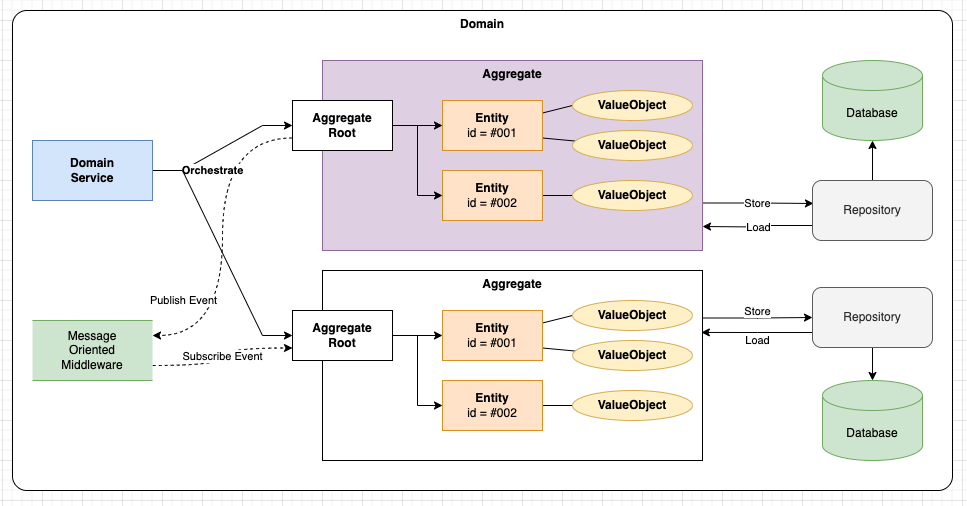
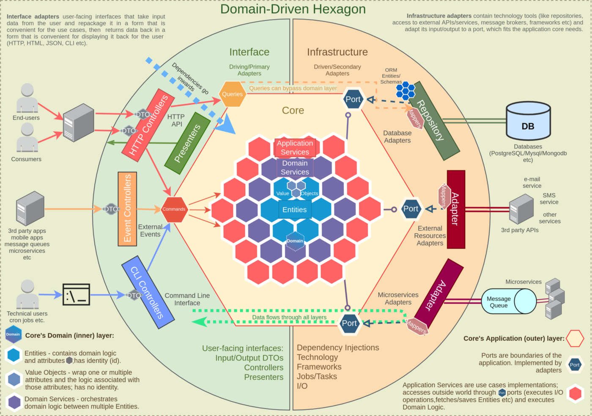

# Domain Driven Design 

- Domain-Driven Design (DDD)은 소프트웨어 아키텍처와 설계 방법론 중 하나로, 복잡한 도메인을 이해하고 모델링하는 데 초점을 둔다. 


## DDD에서 중요 개념

### Business Domain (비즈니스 도메인)

- 애플리케이션의 핵심 비즈니스 영역
- 비즈니스 도메인은 조직의 핵심 업무 영역이며 독립적으로 발전하고 변화할 수 있다.
- 다른 경쟁사와 차별되는 핵심 서비스 영역을 가지고 있다. 
- 진입장벽이 높고, 조직 자체적으로 개발/운영하는 서비스이다. 
- 예: 특화된 전자 상거래, 은행, 항공 등

### Core Subdomain (핵심 서브도메인)

- 비즈니스의 핵심 영역으로, 조직의 경쟁 우위를 제공하는 서브도메인이다.
- 핵심 서브도메인은 비즈니스의 핵심 규칙과 핵심 도메인 모델을 포함한다.
- 주요 비즈니스 프로세스와 관련된 서비스와 엔티티가 포함된다.
- 비즈니스 도메인과 같은 개념으로도 사용된다. 

### Generic Subdomain (일반 서브도메인)

- 비즈니스의 핵심 영역은 아니지만 여러 서브도메인에서 공통으로 사용하는 서브도메인이다.
- 일반 서브도메인은 공통 기능이나 도메인 규칙을 제공하고 다른 서브도메인과 협력한다.
- 주로 지원적인 역할을 수행하며 핵심 서브도메인에 비해 상대적으로 낮은 중요도를 가진다.
- 다양한 조직, 회사에서 사용하고 있는 공통적인 영역에 대한 도메인이다. 
- 쇼핑몰 어드민, 쇼핑상품 등.

### Support Subdomain (지원 서브도메인)

- 비즈니스 도메인을 지원하는 서브도메인으로, 주로 기술적이거나 인프라 관련 기능을 제공한다.
- 지원 서브도메인은 보안, 로깅, 메일 발송 등과 같은 기술적인 요구사항을 처리한다.

### Ubiquitous Language

- 특정 Domain에서 사용되는 언어
- 비즈니스를 표현하는 언어로, 비즈니스 전문가, 개발자, 관련 스테이크홀더 모두 이해하는 언어
- 비즈니스 분석 및 설계 과정에서 언어는 만들어지고, 정제 되는 과정을 거친다. 
- Bounded Context 내에서 한정적으로 사용된다. 
- 동일한 단어라도 각 Bounded Context가 다르면 내표하는 의미는 다르게 된다. 

### Bounded Context

- 동일한 Ubiquitous Language를 사용하는 업무 영역
- Bounded Context는 특정 비즈니스 도메인에서 발생되는 다양한 문제를 해결하기 위해서 core-domain/sub-domain 을 구분하고 이들의 경계를 구분하는 영역이다.
- Bounded Context의 범위에 정답은 없다. 조직 구조와 역량에 따라 적절히 조절 필요 


from: https://martinfowler.com/bliki/BoundedContext.html

------------------------

### Value Object (값 객체)

- 도메인에서 개별적인 값을 나타나는 객체 
- 불변(Immutable)하며, 값에 의해 동등성이 결정됨 
- 부작용이 없어야 하며, 도메인 규칙을 포함하거나 적용할 수 있다.
- Value Object에서는 값의 범위체크, 값 검증등을 자체적으로 수행한다. 즉, 갑 객체의 Rule 를 포함하고 있다. 
- 예: 날짜, 시간, 돈, 주소 등

#### 샘플 소스

```java
public class Money {
  private BigDecimal amount;
  private Currency currency;

  // ...기타 생성자/Get/Set ...
} 
```

- 참고: 잘못된 자바 Class 정의

```java
public class User {
  private Long id;
  private String name;

  // 금전 속성 
  private BigDecimal amount;
  private Currency currency;

  ... 기타. 
}
```

- 위 코드는 User 객체에 금전 속성등 세세한 정보가 모두 포함됨
- 해당 코드들에 대한 규칙/범위 정보들을 모두 User 클래스에서 검증해야함
- 이렇게 다양한 문제점이 있기에, ValueObject를 사용하면,  User 엔터티 자체에 집중할 수 있음 

### Entity (개체)

- 도메인에서 식별 가능하며, 고유한 개체를 나타내는 객체
- 식별자(Identity)에 의해 구분된다. 
- 속성과 동작을 가지며, 생명주기를 가진다.
- 데이터베이스에서 영속적으로 저장되는 경우가 많다.
- 예: 사용자, 주문, 상품 등

#### 샘플 소스

```java
public class User {
  private Long id;
  private String name;
  private Email email;

  // ... 기타 생성자/Get/Set ...
}
```

### Aggregate (집합체)

- 개체(Entity)의 논리적인 그룹화
- 하나의 Aggregate는 루트(Entity)를 가지며, 루트를 통해 다른 개체에 접근하고, root를 통해 다른 개체가 접근하게 된다. 
- Aggregate는 한 번에 원자적으로 조작되어야 하며, 일관성과 불변성을 유지한다.
- 예: 주문과 주문 라인 아이템을 포함하는 주문 Aggregate

#### 샘플 소스

```java
public class Order {
    private Long id;
    private User user;
    private List<OrderItem> items;

    // ... 기타 생성자/Get/Set ...
}
```

### Service (서비스)

- 도메인 로직을 구현하는 도메인 이외의 기능을 처리하는 객체
- 주로 도메인 객체 사이의 협력이 필요한 복잡한 작업을 처리
- 트랜잭션 경계를 설정하거나 외부 시스템과의 통합을 처리하는 역할을 할 수 있다.
- 예: 결제 서비스, 메일 서비스, 인증 서비스 등

#### 샘플 소스

```java
public class PaymentService {
    public void processPayment(Order order, Money amount) {
        // 결제 로직 구현
    }
}
```




## Hexagonal Architecture

- Domain Driven Design에서 주로 사용하는 아키텍처 모델
- Port-Adapter 아키텍처라고도 하며, Hexagonal Architecture라고도 한다. 
- Hexagonal Architecture(또는 Ports and Adapters Architecture)는 의존성 역전 원칙(Dependency Inversion Principle)을 기반으로 한 아키텍처 패턴이다. 
- 이 아키텍처 패턴은 비즈니스 로직과 외부 환경(예: 데이터베이스, 외부 서비스) 사이의 결합도를 낮추고 테스트 용이성과 확장성을 개선한다.



from: https://github.com/xmolecules/jmolecules/discussions/70

- Domain Driven Hexagonal Architecture 디자인 과정을 확인하고자 한다면 [다음 Site](https://herbertograca.com/2017/11/16/explicit-architecture-01-ddd-hexagonal-onion-clean-cqrs-how-i-put-it-all-together/)를 참조 

### Sample 예제

```java
// Port 인터페이스
public interface UserRepository {
    User getUserById(String userId);
    void saveUser(User user);
}

// Adapter 구현체1
public class InMemoryUserRepository implements UserRepository {
    private Map<String, User> users = new HashMap<>();

    @Override
    public User getUserById(String userId) {
        return users.get(userId);
    }

    @Override
    public void saveUser(User user) {
        users.put(user.getId(), user);
    }
}

// Adapter 구현체2
public class MySQLUserRepository implements UserRepository {
    private Map<String, User> users = new HashMap<>();

    @Override
    public User getUserById(String userId) {
        return users.get(userId);
    }

    @Override
    public void saveUser(User user) {
        users.put(user.getId(), user);
    }
}

// 비즈니스 로직
public class UserService {
    private final UserRepository userRepository;

    public UserService(UserRepository userRepository) {
        this.userRepository = userRepository;
    }

    public User getUserById(String userId) {
        return userRepository.getUserById(userId);
    }

    public void saveUser(User user) {
        userRepository.saveUser(user);
    }
}

// Main 클래스
public class Main {
    public static void main(String[] args) {
        UserRepository inMemoryUserRepository = new InMemoryUserRepository();

        UserRepository mySQLUserRepository = new MySQLUserRepository();

        // 어떤 Adapter 를 선택할지 취사 선택 가능
        UserService userService = new UserService(inMemoryUserRepository);

        User user = new User("123", "John Doe");
        userService.saveUser(user);

        User retrievedUser = userService.getUserById("123");
        System.out.println(retrievedUser.getName()); // 출력: John Doe
    }
}

```

- 위 Sample 코드는 UserRepository라는 Port 인터페이스를 설정하고, 해당 Port에 맞는 다양한 Adapter를 사용할 수 있다. 
- Adapter는 InMemoryUserRepository 와 MySQLUserRepository 2개를 구성하고 있으며, 필요한경우 추가적인 Adapter를 쉽게 추가할 수 있으며, Adapter를 추가해도 Core 비즈니스 로직에 변경사항은 없다. 

## WrapUp

- Domain Driven Design은 비즈니스 영역을 Domain으로 구분하고, 비즈니스 전문가와 개발 전문가가 협업하여 서비스를 만들어 가는 디자인 방법이다. 
- 도메인은 핵심, 일반, 보조 서브도메인으로 구성된다. 
- 각 도메인은 유비쿼터스 언어를 사용하여 비즈니스를 표현한다. 
- Bounded Context는 유비쿼터스 언어가 사용되는 영역 경계로, 도메인을 그룹화 하는 영역이다. 
- DDD에는 다양한 요소가 있으며, ValueObject, Entity, Aggregate, Aggregate Root, Domain Service, Resository 등이 있다. 