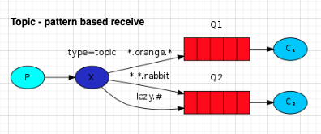

# Event Driven Architecture

- 이벤트 기반 아키텍처는 시스템의 컴포넌트 사이에 비동기 이벤트를 송/수신하는 아키텍처이다. 
- 이벤트의 발행: Publish
- 이벤트의 구독: Subscribe 
- 이벤트 전달: MOM(Message Oriented Middleware) 
  - Message Broker / Event Bus 등으로 표현
- 느슨한 결합가능

## 장점

- 느슨한 결합도
  - 컴포넌트 상호간에 비동기 통신을 수행하므로 결합도가 낮아짐 (Send and Forget)
- 확장성
  - 컴포넌트를 쉽게 추가하고, 다른 컴포넌트에 영향을 최소화 하면서 기능확장 가능
- 유연성
  - 변화에 대해서 유연한 시스템 구조
- 비동기처리
  - 비동기 처리를 통해 시스템의 응답성/성능 향상

## 단점

- 복잡성
  - MOM의 추가로 인해서 아키텍처가 복잡함
  - 이벤트의 흐름을 추적하기 어려움
- 장애처리
  - 이벤트 처리중 오류 처리가 어려움
  - 보상이벤트 등의 작업이 필요 

## Event Driven Architecture 패턴 

- 일반적인 EDA 아미텍처이다. 
- 메시지를 전송하면 Event Bus(Message Broker) 에서 메시지를 받는다. 
- 특정 패턴에 따라 메시지를 특정 큐에 전송한다. 
- 이후 컨슈머는 자신이 Listen 하고 있는 큐에서 메시지를 가져가고, 특정 처리를 수행한다. 

### 기본 메시지 전송 

- 단순 메시지 큐에 메시지를 Publish 하고, 컨슈머는 Queue로 부터 메시지를 소비한다. 

### 경쟁적 메시지 수신

- Producer는 메시지를 MessageBroker로 전달한다. 
- Exchanger는 수신받은 메시지를 Queue로 전달한다. 
- 여러 Consumer가 동일한 Queue를 Listen하고있으며, 경쟁적으로 메시지를 가져간다. 
- 먼저 가져가는 Consumer가 메시지를 처리하고, 다른 Consumer는 다른 메시지를 가져가게 된다. 

### Pub/sub Pattern 

- Producer는 메시지를 MessageBroker로 전달한다. 
- 메시지의 패턴 (헤더, 타입)  을 분석하여 적절한 Queue로 메시지를 전달한다. 이때 동일한 메시지가 여러 Queue로 동시에 전달된다. 
- Consumer는 자신이 바라보는 메시지 Queue에서 메시지를 가져간다. 
- 이 방식은 동일한 메시지를 여러 Consumer가 수신하는 방식으로 Fan-Out 이라고 부른다. 

### Routing

- Producer는 메시지를 MessageBroker로 전달한다.
- 메시지의 패턴 (헤더, 타입) 을 분석하여 지정된 Queue로 메시지를 라우팅한다. 
- Consumer는 자신이 바라보는 Queue에서 메시지를 수신해간다.
- 이 방식은 하나의 MessageBroker로 여러가지 일을 수행할 수 있는 장점이 있다. 

### Topic 방식 

- Topic은 특정 메시지를 그룹화한 논리적 메시지 유형을 설정한다. 
- Topic내에서 Exchange는 메시지의 패턴을 분석하고 해당메시지 Queue로 메시지를 전달한다. 
- Consumer는 자신이 바라보는 Queue에서 메시지를 수신해 간다. 

### RPC (Remote Procedure Call)

- Client가 Server에 특정 함수를 호출하는 경우에 유용하다. 
- Client가 메시지를 MessageBroker에 전송하는 방식은 동일하다. 
- 함수 호출을 위한 호출 정보 및 파라미터 정보를 메시지에 실어 Queue로 전송한다. 
- Server는 메시지를 수신받고, 호출 정보를 바탕으로 자신 내부의 함수를 호출한다. 
- 호출 결과는 응답 Queue에 전송하고, Client가 이 결과를 받아 다음 처리를 수행한다. 

- 참고: 위 내용은 RabbitMQ 에서 발췌
- https://www.rabbitmq.com/getstarted.html

## EDA 도구

- RabbitMQ: https://www.rabbitmq.com/getstarted.html
- ActiveMQ: https://activemq.apache.org/
- Kafak: https://kafka.apache.org/

## WrapUp

- EDA는 비동기 메시지 송신/수신 방식으로 컴포넌트간 커뮤니케이션을 수행하는 아키텍처이다. 
- 느슨한 결합과, 높은 확장성, 성능의 이점이 있다. 
- 복잡한 아키텍처와, 모니터링이 쉽지 않기 때문에 이에 대한 대응방안이 필요하다. 
- EDA는 단순한 Queue 부터 Topic, RPC등과 같이 다양한 형태의 요구사항을 수행한다. 