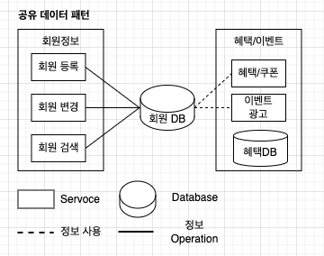

# Shared Data Pattern

- Shared Data Pattern은 여러 컴포넌트 또는 서비스가 동일한 데이터를 공유하는 방식으로 구성된 아키텍처 패턴 
- 데이터의 일관성과 중복을 피하면서 데이터의 공유와 업데이트를 효율적으로 관리할 수 있도록 한다. 

## 장점:

- 데이터 일관성 유지: 
  - 여러 컴포넌트 또는 서비스가 동일한 데이터를 공유하기 때문에 데이터 일관성을 유지하기 쉽다
- 중복 최소화: 
  - 데이터를 중앙 집중화하여 중복 데이터를 최소화할 수 있다.
- 성능 향상: 
  - 데이터에 대한 중앙화된 접근을 통해 데이터 업데이트 및 조회 성능을 향상시킬 수 있다.
- 확장성: 
  - 데이터 공유를 통해 새로운 컴포넌트 또는 서비스를 쉽게 추가할 수 있다.
  
## 단점:

- 의존성과 결합도 증가: 
  - 다양한 컴포넌트가 동일한 데이터를 공유하기 때문에 컴포넌트 간의 의존성과 결합도가 증가할 수 있다.
- 동시성 문제: 
  - 여러 컴포넌트가 동일한 데이터를 업데이트할 때 동시성 문제가 발생할 수 있으며, 이를 관리하기 위해 동기화 메커니즘이 필요하다.

## 베스트 프랙티스:

- 데이터 접근 제어: 
  - 공유 데이터에 대한 접근을 효과적으로 제어하기 위해 동시성 제어 및 동기화 메커니즘이 필요하다.
- 이벤트 기반 업데이트: 
  - 데이터의 변경 사항을 이벤트로 전파하여 다른 컴포넌트에 업데이트를 알리는 방식을 사용할 수 있다.
- 관리 및 감사 로그: 
  - 공유 데이터의 업데이트 및 액세스를 모니터링하기 위해 로깅 및 감사 메커니즘을 구현해야 한다.
- 데이터 일관성 유지: 
  - 공유 데이터의 일관성을 유지하기 위해 트랜잭션 처리나 적절한 동기화 메커니즘을 사용해야 한다.

## 아키텍처

- 위와 같이 회원 DB는 다양한 도메인에서 사용되고 있다. 
- 회원 DB를 다른 도메인이 함께 공유함으로써 데이터를 직접 핸들링 할 수 있다. 
- 다만 이경우 혜택/이벤트에서 데이터를 오퍼레이션 하지 않도록 하는 것에 주의하자. 

## WrapUp

- 공유 데이터 모델은 공통적으로 꼭 사용되어야하는 데이터를 공유 데이터로 지정하고, 연관된 컴포넌트들이 직접 참조하는 방식이다. 
- 직접 컨트롤 할 수 있는 장점이 있지만, 공유 Database와 연결된 정보와 묶이기 때문에 변경에 대한 사이드 이펙이 발생할 가능성이 높은 단점도 존재한다. 
- 공유 되어야하는 데이터가 무엇인지 파악하고, 데이터의 오퍼레이션과 조회를 확실히 분리할 필요가 있는 아키텍처이다. 