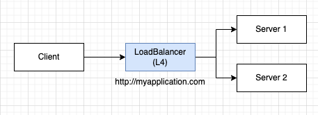
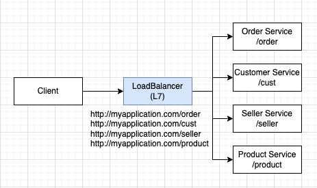

# LoadingBalancing Pattern 

## 개요

- Load Balancing Pattern은 서버 혹은 서비스의 부하를 분산하는 디자인 패턴
- 단일 서버가 처리할 수 없는 양의 트래픽을 처리하기 위해 여러 서버에 작업을 분산하는 것을 목적으로 함

## LoadBalancer 대표적 타입

### L4 (Layer 4)

- OSI 7Layer 모델에서 Layer 4에 해당 (Transport Layer) 
- IP/Port 를 기반으로 대상 서버로 부하를 분산한다. (TCP, UDP)
- 패킷 헤더중 IP/Port 만을 검색하므로 부하분산 성능이 뛰어나다. 

### L7 (Layer 7)

- OSI 7Layer 모델에서 Layer 7에 해당 (Application Layer)
- 보통 HTTP 프로토콜 상에서 URI, Payload 내용, Header, Cookie 등을 확인하고 적정한 서버로 부하분산
- 패킷 내용을 분석하여 분산하므로 L4에 비해서 성능이 떨어짐
- 대신 더욱 다양한 조건에 따라 부하분산이 가능

## 부하분산 패턴

- 크게 Proxy-Based LB와 DNS-Based LB가 있음 
- Proxy-based Load Balancing
  - 클라이언트와 서버 사이에 로드 밸런서를 두고, 클라이언트의 요청을 로드 밸런서가 받아서 이를 서버들에게 분배하는 방식
  - 대표적으로 Nginx, HAProxy 등이 있다.
- DNS-based Load Balancing
  - DNS 서버에 여러 서버의 IP 주소를 등록하고, 클라이언트가 해당 DNS 주소를 호출하면, DNS 서버가 가장 적은 부하를 가진 서버의 IP 주소를 반환하는 방식 
  - 대표적으로 AWS Route 53, Cloudflare Load Balancer 등이 있다.
## 부하분산 정책

- Round Robin
  - 클라이언트 요청을 받아 여러 서버 중 하나를 선택하고, 순서대로 분배하는 방식
- Least Connection
  - 현재 연결 수가 가장 적은 서버를 선택하여 작업을 분배하는 방식
- IP Hash
  - 클라이언트 IP 주소를 해싱하여 해당 해시 값에 해당하는 서버에 작업을 분배하는 방식
- Random
  - 무작위로 서버를 선택하여 작업을 분배하는 방식

## LoadBalancing 사용이유 

- 높은 가용성(High Availability)
  - 여러 대의 서버를 사용하므로, 하나의 서버에 장애가 발생해도 시스템 전체가 중단되지 않는다.
- 성능 개선
  - 여러 대의 서버를 사용하므로, 각 서버에 부하를 분산하여 서버의 처리 성능을 개선
- 확장성
  - 서버를 추가로 늘려서 시스템의 성능을 쉽게 확장할 수 있다.

## 베스트 프랙티스 

- Scale-up 방식보다는 Scale-out 사용하기 
  - 단일 서버에서 처리할 수 없는 부하를 처리하기 위해 서버의 성능을 업그레이드하는 것보다 여러 대의 서버를 추가하는 것이 더 효율적이다. 
  - 성능 업그레이드는 한계가 존재하며, 한계에 다다를수록 비용이 급격히 증가한다. 
- Health Checking
  - 부하 분산 서비스를 운영할 때에는 각 서버의 상태를 주기적으로 체크하여 문제가 발생하면 자동으로 해당 서버에서 작업을 분배하지 않도록 처리
  - L4는 IP/Port 기반으로 Health Check를 수행
  - L7은 /uri 패턴 기반으로 Health Check를 수행
- Sticky Session
  - 클라이언트가 여러 요청을 보낼 때, 같은 서버로 요청이 전송되도록 하여 세션 정보를 유지하는 방식
  - Sticky Session은 고정된 서버로 요청을 보낼 수 있어서 요청을 위한 메타정보를 서버에 유지하기 편리함
  - 그러나 서버가 다운되는 경우 클라이언트는 일시적 장애 상황으로 떨어질 수 있음 
- SSL Termination
  - SSL 암호화된 요청을 해독하는 작업을 로드 밸런서에서 처리하여, 백엔드 서버에서는 복잡한 암호화 작업을 처리하지 않도록 하기
- Security
  - 로드 밸런서 자체의 보안에 대한 고민도 필요, 악의적인 클라이언트의 요청을 걸러낼 수 있도록 준비
- Monitoring 
  - 로드 밸런서를 통해 전체 서버의 부하 및 상태를 모니터링할 수 있으므로, 서비스 운영에 있어서도 유리

## WrapUp

- LoadBalancer는 클라이언트의 요청을 L4, L7 등을 이용하여 다수의 서버로 부하를 분산하기 위한 목적으로 사용된다. 
- L4는 IP/Port 기반으로 대량의 트래픽을 처리하기에 적합하다. 
- L7은 HTTP 기반을 주로 사용하며 Header, URI, Cookie, Payload 등을 분석해서 부하를 분산한다. 

