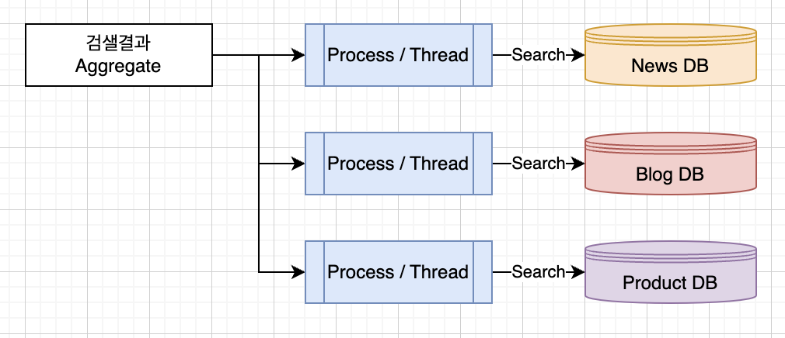

# Scatter and Gather Patterns

## 개요

- Scatter Gather Pattern은 분산 시스템에서 병렬 처리를 위해 사용되는 패턴이다. 
- 입력 데이터를 여러 대상 시스템에 분산하여 처리하고, 처리된 결과를 다시 모아서 출력 데이터로 만드는 방식으로 작동한다.

### 검색 예시

- 대표적인 예시로는 검색 엔진에서 검색어를 여러 데이터베이스에 분산하여 검색하는 방식이 있다. 
- 검색어를 분산하여 처리하는 단계를 Scatter, 처리된 결과를 다시 합쳐서 출력 데이터로 만드는 단계를 Gather라고 한다.

### Map Reduce

- 빅데이터 처리에서 가장 주로 사용하는 패턴인 Map Reduce 역시 Scatter Gatter 패턴이다. 

### Multi Thread

- Java8 이상부터 나온 CompatibleFuture 를 활용하면, 멀티 쓰레드를 생성하여, 복수개의 일을 요청하고, 모든 결과가 돌아오기 전까지 Future 로 대기한다. 
- 결과가 돌아오면, Future에서 결과값을 추출하여 집계 연산을 수행하고, 최종 결과를 반환한다. 
- 참고 Source: https://github.com/unclebae/spring-async/tree/master

## 베스트 프랙티스

- 병렬성 
  - 입력 데이터를 분산하여 병렬로 처리하므로, 처리 시간을 단축시키고, 시스템의 성능을 향상시킬 수 있다.
- 확장성
  - 대규모 데이터 처리 작업에서도 처리 시간을 유지하면서 시스템의 확장성을 보장할 수 있다.
- 신뢰성
  - 여러 대상 시스템에서 처리가 가능하므로, 한 시스템의 장애가 발생해도 전체 시스템의 처리가 중단되지 않는다.
- 유연성  
  - 대상 시스템의 개수와 역할을 변경하거나, 데이터 처리 과정에서 다른 패턴을 적용할 수 있다.
- 보안성
  - 데이터 분산 처리시, 각 시스템간에 인증 및 보안 프로토콜을 적용하여 보안성을 보장할 수 있다.
## WrapUp

- Scatter Gather Pattern은 대규모 데이터 처리 작업에서 유용하게 사용되며, 병렬 처리를 통해 처리 시간을 단축시키고, 시스템의 확장성을 보장할 수 있는 장점이 있다.

## Reference

- https://www.todaysoftmag.com/article/1358/hadoop-mapreduce-deep-diving-and-tuning
- https://github.com/unclebae/spring-async/tree/master