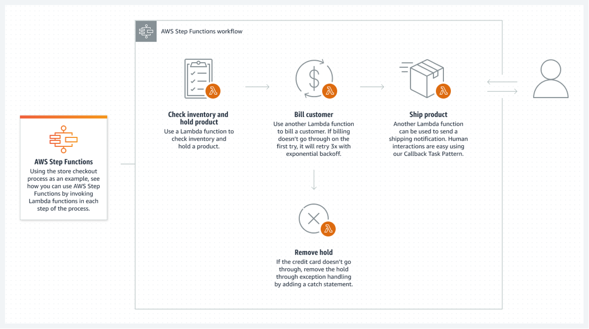

# Orchestrator Pattern

## 개요

- Orchestrator Pattern은 여러 개의 서비스나 컴포넌트를 조합하여 하나의 흐름으로 제어하는 디자인 패턴이다.
- 이 패턴에서는 모든 서비스 또는 컴포넌트를 중앙에서 제어(중앙 집중형 Orchestrator)하며, 서비스 간의 의존성 및 호출 순서를 정의하여 비즈니스 로직을 실행한다.
- Orchestrator 는 각 서비스 또는 컴포넌트의 동작을 제어하고 이들간 통신을 조율한다.
- 이는 마치 오케스트라의 지휘자와 같은 역할을 한다고 하여 Orchestrator 라고 부른다. 

image from:  https://dev.to/abarran03/microservices-patterns-orchestration-and-choreography-j06

- 위와 같이 Service 1 은 Orchestrator 역할을 수행한다. 
- Service 2와 Service 3 에 요청을 수행하고, 결과를 조합하거나, 문제 발생시 보상 처리등을 직접 Service 1이 수행하게 된다. 
## Orchestrator 예

### Workflow Management System

- Workflow Management System은 여러 개의 작업(Task)을 정의하고, 이를 조합하여 워크플로우(Workflow)를 구성하며, 워크플로우의 실행을 중앙에서 제어하는 시스템이다.
- 대표적인 서비스로 AWS Step Functions과 Azure Logic Apps 등이 있다. 

### AWS Step Functions

- AWS Step Functions는 서버리스 애플리케이션을 구축하기 위한 완전 관리형 워크플로우 서비스로, 여러 개의 AWS Lambda 함수 또는 다른 서비스 간의 연결과 조율을 제공

image from: https://aws.amazon.com/ko/step-functions/

### Azure Logic Apps

- AWS Step Functions과 유사한 기능을 수행하며, 워크플로우를 제어한다. 

image from: https://learn.microsoft.com/en-us/azure/logic-apps/logic-apps-overview

### Kubernetes

- Container Orchestrator 를 수행하여, 컨테이너를 관리하고, 이들간의 통신, 시스템의 항상성을 유지한다. 

image from: https://www.suse.com/c/rancher_blog/the-three-pillars-of-kubernetes-container-orchestration/

## 특징

- 모든 처리 프로세스를 하나의 컴포넌트가 관리, 처리, 조율한다. 
- 다른 컴포넌트에 비해서 Orchestrator 의 역할과 책임이 매우 크다. 
- 분산 트랜잭션 관리자로 Orchestrator를 통해서 트랜잭션 요청 및 보상 트랜잭션 처리등을 수행하는 패턴으로 사용된다. 

iamge from: https://www.gaurgaurav.com/patterns/orchestration-pattern/

- 위 다이어 그램은 Orchestrator 가 Queue를 통해서 트랜잭션 호출 (Command Queue 이용)과 결과를 수신(Response Queue 이용) 하고 있다. 
- Payment Auth Service, Risk Management Service, PCI Compliance Service, Transaction Service 등과 같은 서비스를 호출하고 있으며, 요청과 처리결과를 Orchestrator가 관장한다. (처리순서, 요청, 응답처리, 문제에 대한 보상처리등)

## Best Practices

- 모듈화
  - 비즈니스 로직을 수행하는 각 서비스 또는 컴포넌트를 모듈화하여, 코드의 가독성 및 유지보수성을 높여야 한다.
  - 각 서비스 또는 컴포넌트는 독립적으로 동작할 수 있어야 하며, Orchestrator 서비스에서는 이들 간의 연결과 조율만을 수행
- 확장성
  - 서비스나 컴포넌트를 추가하거나 제거하여 시스템의 확장성을 향상시켜야 한다.
  - 서비스나 컴포넌트의 수가 증가할 경우에도, Orchestrator 서비스에서는 충분한 확장성을 제공해야한다.
- 이중화
  - 중앙 제어를 담당하는 Orchestrator의 이중화를 통해, 시스템의 가용성을 높일 수 있다.
- 에러 처리
  - 서비스 호출 과정에서 발생하는 예외나 에러를 적절히 처리하여 시스템의 안정성을 높여야 한다.
- 모니터링
  - Orchestrator에서 서비스의 호출 순서나 응답 시간 등을 모니터링하여, 시스템의 성능 및 가용성을 향상시켜야 한다.
  - Orchestrator 서비스에서는 각 서비스 또는 컴포넌트의 동작을 모니터링하고, 이를 적절하게 로깅하여 이후 분석을 위한 정보를 수집

## Wrap Up

- Orchestrator 패턴은 워크플로우, 비즈니스를 중앙집중형 Orchestrator에서 관리하고 조율하는 패턴이다. 
- 이를 이용하면, 분산환경의 트랜잭션을 적절히 조절하고, 흐름을 모니터링하거나, 문제 발생시 보상 트랜잭션 등을 적절히 수행할 수 있다. 
- 중앙 관리이기 때문에 관리의 편의성은 있으나, 확장에 대해서는 중앙 Orchestrator를 직접 수정해야하는 문제를 가지고 있다. 

## 참고:

- https://dev.to/abarran03/microservices-patterns-orchestration-and-choreography-j06
- https://www.gaurgaurav.com/patterns/orchestration-pattern/
- https://aws.amazon.com/ko/step-functions/
- https://learn.microsoft.com/en-us/azure/logic-apps/logic-apps-overview
- https://www.suse.com/c/rancher_blog/the-three-pillars-of-kubernetes-container-orchestration/