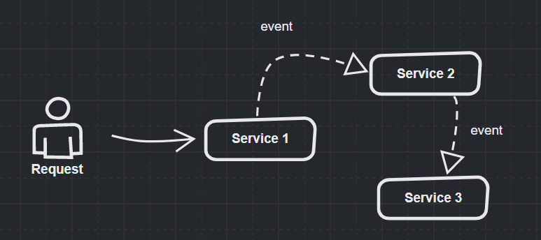
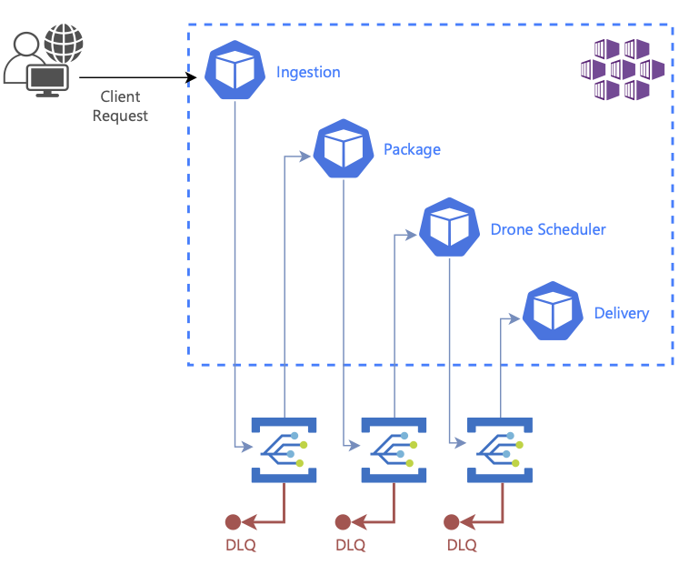
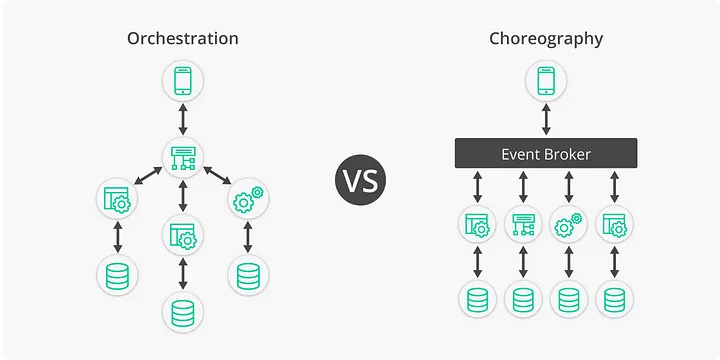

# Choregraphy Pattern

## 개요

- Choreography Pattern은 시스템에서 독립적인 서비스가 서로 상호작용하여 원하는 결과를 도출하는 분산 시스템 아키텍처 패턴이다. 
- 서로 다른 서비스 간의 상호 작용을 통해 비즈니스 로직을 처리하며, 각 서비스는 일련의 이벤트를 발생시키고 다른 서비스에 대한 응답으로 이벤트를 처리한다. 
- 이를 위해 주로 비동기 통신을 수행한다. 
- 이 패턴에서 각 서비스는 이벤트에 응답하거나 이벤트를 발행할 수 있으며, 다른 서비스와 상호작용할 필요가 없다. 
- 이러한 방식으로 서비스 간 결합도를 낮출 수 있다.

image from:  https://dev.to/abarran03/microservices-patterns-orchestration-and-choreography-j06

## Choregraphy 예

- 마이크로서비스 아키텍처
  - 작고 독립적인 서비스를 만들어 전체 시스템을 구성하는 방식 
  - 각 서비스는 고유한 비즈니스 로직과 데이터를 갖고 있으며, 서비스 간 통신은 비동기적으로 이루어진다.

- 쇼핑몰 주문 처리 시스템
  - 쇼핑몰 주문 처리 시스템은 수많은 서비스로 구성되어 있으며, 이 서비스들은 Choreography Pattern을 사용하여 상호 작용한다. 
  - 예를 들어, 사용자가 새로운 주문을 만들면 주문 서비스가 이벤트를 발생시키고, 이벤트에 대한 응답으로 결제 서비스, 배송 서비스 등 다른 서비스들이 처리를 수행한다.

image from: https://learn.microsoft.com/en-us/azure/architecture/patterns/choreography

## 장점

- 서비스 간 결합도가 낮아져 시스템 유연성과 확장성이 증가
- 비즈니스 로직과 데이터가 분리되어 유지보수와 확장이 쉬움
- 서비스의 추가, 수정, 삭제가 용이

## 단점 

- 각각의 서비스가 독집적으로 수행되므로 시스템의 복잡도가 증가한다. 
- Fire and Forget 방식으로 메시지를 전송하고, 자신의 작업을 수행하므로, 프로세스 도중의 문제를 파악하기 쉽지 않다. 
- 문제 발생시 재시도 방식에 대한 복잡도가 증가한다.
- 프로세스의 흐름을 따라가기 쉽지 않다. 
  
## 베스트 프랙티스 

- 이벤트 기반 아키텍처/서비스 간 통신은 비동기 방식을 사용
  - 이벤트의 명확한 정의
    - 각 이벤트는 명확하게 정의되어야 하며, 이벤트가 발생했을 때 어떤 처리를 수행해야 하는지 알 수 있어야 한다.
  - 이벤트의 버전 관리
    - 이벤트의 버전을 관리하여 다른 서비스에서 이벤트를 쉽게 이해하고 처리할 수 있도록 한다.
  - 이벤트 처리의 일관성
    - 이벤트를 처리하는 방식이 각각의 서비스에서 일관성 있게 이루어져야 한다.
  - 이벤트 브로커의 사용
    - 이벤트 브로커를 사용하여 서비스 간에 이벤트를 전달하고 처리할 수 있습니다. 이벤트 브로커를 사용하면 서비스 간의 결합도를 줄일 수 있다.
- 각 서비스는 독립적으로 작동하도록 설계
- 비즈니스 로직과 데이터를 서비스 간에 분리
- 이벤트 스키마를 일관성 있게 관리

## WrapUp

- Choregraphy 패턴은 비동기 처리에 주로 사용되며, 각 서비스들은 독립적으로 자신의 업무를 수행하고, 타 컴포넌트와 통신을 위해서 메시지 Queue를 사용한다. 
- 서비스는 요청을 타 컴포넌트에 전송하고, 자신의 일을 수행한다. 
- 개발에 대한 편의는 존재하지만, 컴포넌트는 자신의 일만 알기 때문에 모니터링이 쉽지 않고, 문제 발생시 발생지점을 파악하거나, 이를 위한 보상처리가 쉽지 않다. 

image from: https://levelup.gitconnected.com/microservices-choreography-best-practices-and-tools-8e46f12bf8f1