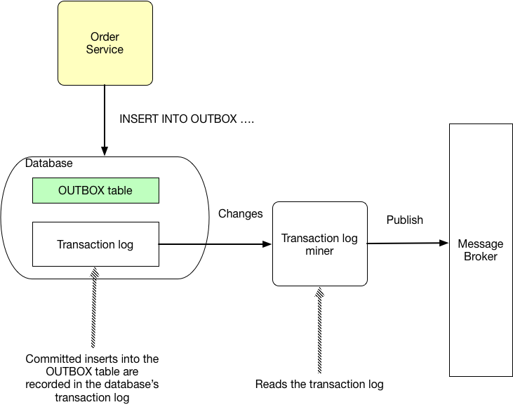

# Transactional Outbox pattern

## 개요 

- Transactional Outbox Pattern은 마이크로 서비스 아키텍처에서 사용되는 비동기 트랜잭션 처리 패턴중 하나이다. 
- 이 패턴은 필요한 트랜잭션을 DB에 저장하고, DB의 내용을 읽고 처리하는 Relay 서비스가 메시지 브로커로 트랜잭션 이벤트를 전송하는 형태를 취한다. 

## 동작 방식 

- 1. Order Service는 주문 정보를 DB의 Order테이블에 내용을 저장한다. 
- 2. 동시에 Outbox table에 트랜잭션으로 수행되어야할 이벤트 내역을 저장한다. 
- 3. Message Relay는 주기적으로 Outbox 테이블을 조회하여 처리되지 않은 이벤트를 읽어 들인다. 
- 4. 읽어들인 메시지는 Message Broker에 퍼블리시 한다. 
- 5. 전송된 메시지는 outbox 테이블에서 해당 이벤트를 삭제한다. 

- 위 과정을 통해서 주문 정보를 원래 주문 테이블에 저장하는 동시에 외부 트랜잭션 처리를 위해 별도의 아웃박스를 사용하여, 시스템의 복잡도를 감소 시킬 수 있다.

## 구성요소

- 그림과 같이 구성요소들은 다음과 같다. 
  - Sender: 메시지를 전송할 서비스를 나타낸다. 여기서는 Order Service가 이에 해당한다. 
  - Database: 데이터베이스는 비즈니스 엔터티와 Message Outbox 정보를 저장하는 저장소이다. 
  - Message outbox: 트랜잭션 메시지를 저장할 저장소이다. 
  - Message relay: 메시지 릴레이는 outbox에서 메시지를 읽어서 브로커로 전달한다. 
  - Message Broker: 메시지 브로커는 외부 트랜잭션을 처리하기 위해 메시지를 전달하는 미들웨어이다. 대표적으로 RabbitMQ, ActiveMQ, Kafka등이 있다. 

## Message Relay 구성방식 

### Polling 구성 

- Message Relay는 Outbox에서 메시지를 읽어 이벤트 브로커로 전송하는 역할을 한다. 
- 이때 Message Relay는 주기적으로 Outbox 테이블을 조회하게 되며 이러한 방식을 메시지 폴링이라고 한다. 
- 폴링 방식은 데이터베이스에 부하를 주거나, 실시간 트랜잭션 처리가 쉽지 않다. 
- https://microservices.io/patterns/data/polling-publisher.html 참조 

### Transaction log tailing

- 비즈니스 트랜잭션이 발생하면 CDC (Change Data Capture) 기술을 이용하여 메시지 커밋 로그를 활용하여 메시지를 전달한다. 

- 이방식을 이용하면 outbox 테이블을 폴링하지 않기 때문에 성능과 실시간성을 향상할 수 있다. 
- CDC를 직접 구현하기 위한 솔루션 도입이 필요하다. 
  - MySQL binlog 
  - Postgres WAL
  - AWS DyanmoDB table stream
  - Kafka Connect (Debezium 플러그인 이용)
## 베스트 프랙티스 

- Outbox 테이블에 이벤트를 저장하는 방법은 다양하게 구성가능
  - 데이터베이스, 파일, 메모리 등이 될 수 있다. 
- 이벤트 고유ID 필요 
  - Outbox 에 저장되는 이벤트는 고유한 ID가 할당되어야 하며, 중복 방지를 보장해야한다. 
- 안정화된 메시지 릴레이
  - 메시지 릴레이는 분산환경에서 안정적으로 실행될 수 있도록 구성필요. 
  - 클러스터링, 스케일링 지원, 다운타임최소화가 필요하다. 
- 이벤트전송 및 처리시 필요사항
  - 멱등성, 재시도, 실패에 대한 정책 및 처리로직 

## 장/단점

- 장점: 
  - 데이터의 일관성이 높다. 비즈니스 트랜젝션과 메시지 큐의 트랜잭션이 분리된다. 이로 인해 일관성이 보장된다. 
  - 시스템의 결합도가 줄어든다. 비동기 방식 통신과 메시지 처리에 대한 신뢰도를 전제로 결합도가 줄어든다. 
  - 높은 확장성. 분리된 서비스를 스케일 아웃하여 성능을 향상시키고, 확장성 높은 시스템 구현이 가능하다. 
- 단점:
  - 메시지 발행후 메시지 큐에 저장하는 과정에서 실패 발생 가능성 존재
  - 메시지 중복 발행 가능성 (멱등성을 필수로 갖추어야한다.)

## WrapUp

- 아웃박스 패턴을 이용하면 인관성 있고, 느슨한 시스템 결합도를 구현할 수 있는 분산 트랜잭션 방법이다. 
- 아웃박스 이용시에 사용하는 방식으로 폴링과 트랜잭션 로그 이용 방법이 있으며, 각각의 특징과 장점에 대해서 알아 보았다. 

- 참고: 
  - https://microservices.io/patterns/data/transactional-outbox.html
  - https://microservices.io/patterns/data/transaction-log-tailing.html
  - https://dzone.com/articles/implementing-the-outbox-pattern