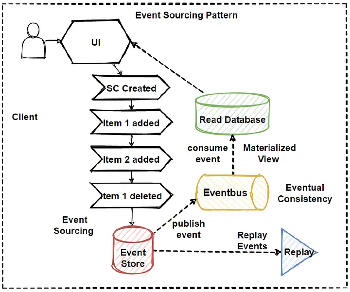

# Event Sorcing Pattern 

## 개요 

- Event Sourcing 패턴은 애플리케이션의 상태 변경을 이벤트 스트림으로 저장하고 나중에 이를 재생성하여 상태를 복원하는 패턴이다. 
- 데이터를 저장하고 복원하는 전통적인 방법과 달리 변경 이력을 저장하므로 데이터 손실을 방지하고 데이터의 무결성을 유지할 수 있다.
- 즉  발생하는 이벤트는 변경 불가한 로그와 같고, 이들은 들어온 순서대로 적재하여 데이터의 무결성을 유지한다. 
- 이벤트는 수정할 수 없으며 
- 또한 과거 lock 형태의 데이터베이스에 이벤트를 적재하고 이를 다시 일관성 있게 저장하므로 많은 복수의 트랜잭션을 처리할 수 있다. 
- 애플리케이션의 모든 상태 변화를 일으키는 이벤트를 저장하고, 이벤트를 통해 애플리케이션의 상태를 재구성한다. 
- 이 패턴은 이벤트 기반 아키텍처와 잘 어울리며, 애플리케이션의 불변성과 일관성을 보장하는 데 매우 유용하다.

## 아키텍처 

- 위 도식과 같이 이벤트가 발생한 순서대로 이벤트 스토어에 발생된 이벤트순서대로 적재 된다. 
- 이벤트 스토어의 내용을 순서대로 읽어 구체화된 뷰를 생성하여 읽기 시스템에서 조회할 수 있도록 구성한다. 
- 이벤트 스토어의 내용은 체크 포인트 지점부터 리플레이를 수행할 수 있으며, 이를 통해 데이터의 감사와 같은 작업을 수행할 수 있다. 

image from: https://medium.com/design-microservices-architecture-with-patterns/event-sourcing-pattern-in-microservices-architectures-e72bf0fc9274

## 사용예

- 금융시스템 
  - 대표적인 예로는 금융 거래 애플리케이션이나 게임 애플리케이션 등에서 사용된다. 
  - 금융 거래의 경우, 모든 거래 내역을 이벤트 로그에 저장하여 각 거래에 대한 기록을 남기고, 거래 이력에 대한 추적이 가능하도록 한다. 
  - 금융거래 이력을 감사하고, 리플레이를 통해서 무결성 유지를 수행할 수 있다. 
- 게임
  - 게임 애플리케이션의 경우, 이벤트 로그에 게임에서 발생한 모든 이벤트를 저장하여 게임 상태를 재생성하고, 게임의 이력을 추적하는 데 사용된다.

## 장점/단점 

- 장점:
  - 시스템의 변경 이력을 추적할 수 있으므로 데이터 손실을 방지하고 무결성을 유지할 수 있다.
  - 이벤트 스트림을 통해 데이터를 복원하면, 시스템의 이전 상태로 되돌릴 수 있다.
  - 이벤트 스트림에서 발생한 데이터는 다른 서비스에서 사용할 수 있다.
- 단점:
  - 구현하기가 어렵고, 시스템의 복잡도가 증가할 수 있다.
  - 이벤트의 유실/중복발생등에 대한 대안이 필요하다. 
  - 구체화된 뷰를 갱신하가 위한 리플레이 구성역시 필요하다. 

## 베스트 프랙티스 

- 이벤트의 변경 사항에 대한 버전 관리를 수행한다.
- 이벤트 로그에 대한 빠른 쿼리를 위해 이벤트 스트림을 사용한다.
- 이벤트 로그의 크기가 커질 때에 대비하여 이벤트 스트림을 파티셔닝한다. 
- 이벤트 스트림의 모든 변경 사항을 반영하는 읽기 전용 모델을 유지한다.
- 이벤트 로그의 모든 변경 사항에 대해 ACID 트랜잭션을 적용한다. 

## WrapUp

- 이벤트 소싱은 작업을 이벤트로 설정하고, 이벤트 저장소에 발생 순서대로 저장한다. 
- 이벤트는 중간중간 특정 시점을 지정하여 저장하며, 리플레이를 수행하고, 감사할 수 있다. 
- 이벤트 소싱은 CQRS, EDA 시스템과 연결하여 사용하며, 확장성과 일관성을 유지하기 위한 패턴이다. 

- 참고:
  - https://learn.microsoft.com/ko-kr/azure/architecture/patterns/event-sourcing
  - https://medium.com/design-microservices-architecture-with-patterns/event-sourcing-pattern-in-microservices-architectures-e72bf0fc9274
  - https://martinfowler.com/eaaDev/EventSourcing.html