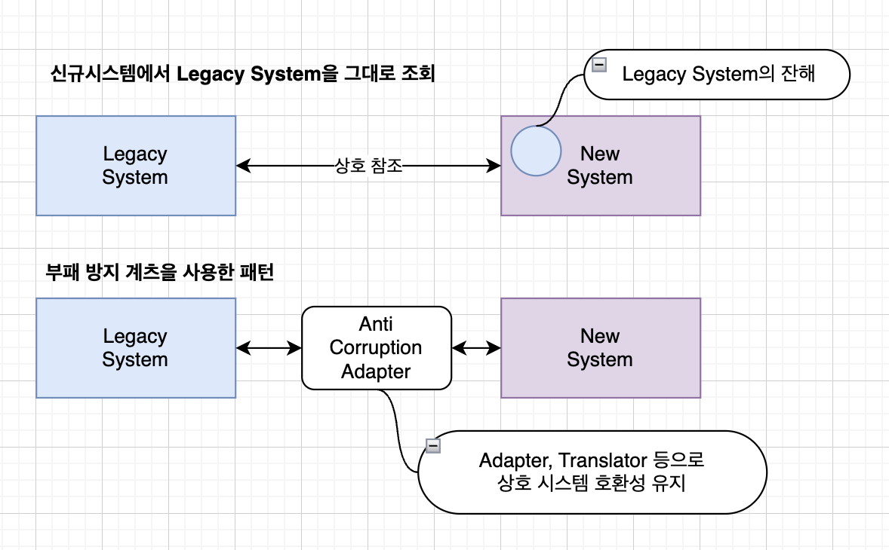

# Anti-Corruption Adapter Pattern

## 개요 

- Anti-Corruption Adapter Pattern은 서로 다른 시스템 간의 상호 작용에서 발생하는 혼란과 복잡성을 해소하기 위해 사용되는 디자인 패턴
- Anti-Corruption Adapter Pattern은 레거시 시스템과 현대 시스템 사이의 경계 영역에서 발생할 수 있는 문제점을 해결하기 위한 소프트웨어 디자인 패턴
- 레거시 시스템은 모델링 방법, 데이터 저장 방법, 프로토콜, 언어 등 다양한 측면에서 현대 시스템과 호환되지 않는 경우가 많음 이때 이 패턴을 사용
- 마이크로서비스 또는 외부 시스템에서 사용되는 용어, 데이터 모델, 프로토콜 등을 현재 시스템에서 사용하는 방식으로 변환하는 방법을 제공한다.
- 레거시 시스템과 현대 시스템 사이의 인터페이스를 변환해주는 어댑터를 둔다.
- 구 시스템과 신규 시스템 사이에 부패 방지 계층을 두어 데이터를 상호 변환하고, 서로간의 영역에 침점하지 않도록 의존성을 줄임 
  
## 사용패턴

- Legacy 시스템과 신규 시스템간 상호작용에 사용
  - Legacy 시스템의 용어, 데이터모델, 프로토콜 등이 다른경우 현재 시스템에 영향을 주지 않고, 신규 시스템과 협업할 수 있도록 Adapter 를 둠
- 예)
  - 기존 고객 데이터와 새로운 시스템의 고객 데이터의 데이터 스키마가 다른경우
  - 기존 시스템의 데이터를 새로운 시스템의 데이터에 맞게 변환기를 두어 변환하여 사용 
  - 이를 통해 복잡성을 줄이고, 각 시스템에 의존성을 줄여준다.
- 예)
  - 대표적인 예시로는 엔터프라이즈 서비스 버스(ESB)가 있다.
  - ESB는 다양한 애플리케이션과 시스템 간의 통합을 위해 사용되는 소프트웨어. 
  - ESB는 Anti-Corruption Adapter 패턴을 사용하여 다른 시스템에서 제공하는 인터페이스를 ESB가 제공하는 인터페이스로 변환해준다.

## 베스트 프랙티스 

- 변환 규칙을 일관되게 적용할 수 있도록 표준화된 인터페이스를 사용
- 인터페이스는 새로운 시스템과 기존 시스템 사이의 중간 계층으로 작동하며, 변환 규칙이 포함된 코드는 인터페이스 내부에 숨겨져 있다.
- 인터페이스와 기존 시스템 간의 결합을 최소화하여 시스템 간의 종속성을 낮춘다.
- 가능한 경우 외부 시스템의 변경에 대한 영향을 최소화하기 위해 변환 규칙을 추상화한다.
- Anti-Corruption Adapter를 설계할 때, 레거시 시스템과 현대 시스템 간의 변환 규칙을 명확히 정의
- Anti-Corruption Adapter는 레거시 시스템과의 통신을 책임지기 때문에 안정성과 확장성이 중요
- 고가용성과 확장성을 고려하여 설계
\
## 아키텍처 

- 위 그림과 같이 Legacy와 통신하기 위해서, Legacy의 코드를 새로운 시스템에 가져오는 것은 좋지 않다. 
- 이렇게 되면 새로운 시스템은 기존 레거시 시스템과 강하게 커플링 되고, 결국 새로운 시스템도 부패 된다. 
- 반면 부패방지 계층을 두면, 기존 시스넼과 새로운 시스템은 격리되고, 커플링이 줄어들게 된다. 

## WrapUp

- 부패방지 패턴은 과거 시스템과 신규 시스템을 이어주거나, 서로다른 이질적인 시스템끼리 상호 연동을 할때 매우 유용한 패턴이다. 
- 부패방지 계층과 통신을 통해서 과거시스템과 신규 시스템 사이에 의존성은 낮아지고, 결국 어떠한 방향으로 시스템이 결정되든지 영향을 주지 않는다는 점에서 자주 사용되는 패턴이다. 