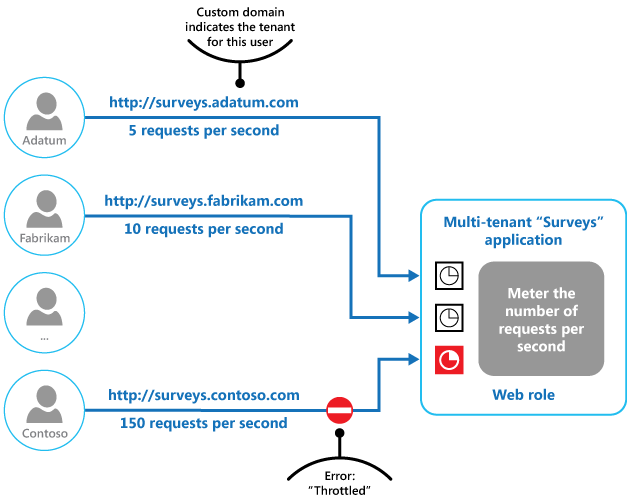

# Throttling and Rate Limiting Pattern

## 개요

- Throttling and Rate Limiting Pattern은 시스템에 대한 트래픽이 과도할 때, 서버에 너무 많은 요청이 도착하는 것을 방지하고, 서비스의 가용성을 유지하기 위한 패턴이다. 
- 서비스의 성능에 영향을 미치지 않으면서 사용자 요청의 처리량을 제한하여 서비스를 안정적으로 유지하므로 시스템의 신뢰성을 향상 시킨다. 
- 시스템의 부하를 관리하기 위해 사용되는 패턴이다.
- 클라이언트의 요청에 대한 응답을 늦추거나, 요청을 거부하거나, 요청의 양을 제한하여 서비스가 과도하게 사용되지 않도록 제어한다.

## 사용예

- API Gateway에서 Throttling and Rate Limiting을 구현
  - 인증 및 인가, 로깅, 모니터링, 스로틀링 등 다양한 역할을 수행할 수 있는 서비스이다.
  API Gateway를 사용하여 Throttling and Rate Limiting을 구현하면, 서버 측에서 별도의 로직을 구현하지 않아도 된다.
- 클라우드 서비스 업체에서도 Throttling and Rate Limiting 기능을 제공하고 있다.
  - Amazon Web Services(AWS)에서는 API Gateway, Elastic Load Balancing(ELB), Amazon CloudFront 등에서 Throttling and Rate Limiting을 구현할 수 있다,

## 베스트 프랙티스 

- 적절한 Throttling and Rate Limiting 값을 설정해야 한다.
  - 이 값은 서비스의 성격과 용도, 서버의 하드웨어 성능 등을 고려하여 결정필요
- 메트릭 모니터링에 입각한 조절
  - 서비스에 대한 요청을 모니터링하여 Throttling and Rate Limiting 값을 조정해야 한다.
- 적절한 용량산정 
  - 예기치 않은 트래픽 증가에 대비하여, 서비스 용량을 적절하게 확장해야 한다.
- 적절한 에러메시지 
  - 서비스에 대한 요청을 처리할 때, 적절한 에러 메시지를 반환해야 한다.
- 보안 및 올바른 요청만 지원
  - 요청의 유효성을 검사하고, 잘못된 요청이나 악성 요청을 거부

## Throttling 패턴의 기본 형태 

from: https://learn.microsoft.com/en-us/azure/architecture/patterns/throttling

- 위와 같이 요청에 대한 metering을 수행하여 클라이언트 요청을 제어
- 각 클라이언트는 계약에 따라 throttling 값을 할당 받으며, 해당 제한값을 넘지 못한다. 

## Throttling in API Gateway

from: https://www.tibco.com/reference-center/what-is-api-throttling

- 위와 같이 API는 Rate limit을 두어 요청 제한을 설정한다. 
- 클라이언트는 자신에게 할당된 rate limit 이내에서만 요청을 수행할 수 있다. 이 limit이 오버되면, 최소 서비스 레벨에 맞는 요청을 받거나, 요청을 거부하게 된다. 

## 참고

- Back Pressure
  - https://www.baeldung.com/spring-webflux-backpressure
- Rate Limiting and Throttling
  - https://docs.mulesoft.com/mule-gateway/policies-mule3-rate-limiting-and-throttling

## Wrap Up

- 시스템이 처리할 수 있는 부하 정도만 서비스하고, 감당하기 어려운경우 적절한 모니터링을 통해 차단하는 시스템 구성이 필요할때 Throttling and rate limit 패턴을 사용한다. 
- 모니터링 메트릭을 적절히 분석하고, 요청을 수행할지 차단할지를 결정하는 방안이다. 
- 대표적인 예로 백프레셔 컨트롤이 있다. 