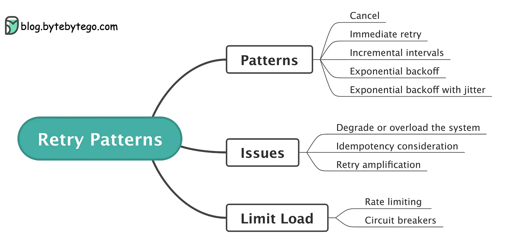

# Retry Pattern

## 개요

- Retry Pattern은 장애 처리 메커니즘 중 하나로, 실패한 요청을 재시도하여 요청이 성공적으로 처리될 때까지 반복하는 패턴이다. 
- Retry Pattern은 네트워크 연결 불안정성이나 서비스 일시적 장애 등으로 인해 실패한 요청에 대해 일정 시간 동안 재시도하는 패턴이다.
- 이 패턴은 분산 시스템에서 매우 유용하다. 
- 네트워크 지연, 리소스 부족 또는 서버 장애 등으로 인해 요청이 실패할 수 있으며, 이를 처리하기 위해 클라이언트는 일시적으로 재시도를 시도한다.
- 장애 발생 시 서비스를 더욱 견고하게 만들어주고, 서비스의 가용성을 높일 수 있다.

## 예

- 대표적인 예로는 네트워크 통신에서 임시적인 장애가 발생했을 때, 클라이언트는 일정 시간 동안 일정한 간격으로 요청을 재시도한다. 
- 이때 일정 시간 동안 지속적으로 재시도를 시도하면 네트워크 리소스를 낭비할 수 있으므로, 이를 방지하기 위해 일정한 간격으로 요청을 보낼 수 있도록 하는 Throttling and Rate Limiting Pattern과 함께 사용될 수 있다.

from: https://learn.microsoft.com/en-us/azure/architecture/patterns/retry

## 장점

- 실패한 요청을 재시도하여 시스템의 가용성을 높일 수 있다.
- 임시적인 장애로 인해 요청이 실패하더라도 클라이언트는 적절히 대처하여 서비스를 계속 사용할 수 있게한다

## 단점

- 재시도가 너무 많은 경우 서버에 부하를 유발할 수 있다.
- 장애가 지속될 경우 재시도를 계속하면서 시스템 자원을 낭비할 수 있다.
- Retry Pattern은 적절하게 구현해야 하며, 최적의 재시도 횟수 및 간격을 설정하는 것이 중요하다.

## 베스트 프랙티스 

- 실패 원인 파악하기: 
  - 실패 원인이 무엇인지 파악하여, 문제를 해결하기 위해 추가적인 조치를 취할 수 있다.
- 백오프 전략 구현하기: 
  - 일정 시간 동안 재시도하는 것이 아니라, 재시도 간격을 점점 늘려가는 백오프 전략을 구현하여, 서버에 부하를 줄이고, 더 나은 성능을 보장할 수 있다.
- 최대 재시도 횟수 제한하기: 
  - 재시도 횟수를 제한하여, 무한히 재시도하는 것을 방지하고, 불필요한 서버 자원 소모를 막을 수 있다.
- 실패한 요청에 대한 로깅: 
  - 재시도를 하는 경우, 실패한 요청에 대한 로깅을 남겨서, 추후 실패 원인 파악을 용이하게 하며, 서비스의 가용성을 향상시키는 데 도움이 된다.
- Circuit Breaker 패턴과 함께 사용하기: 
  - Retry Pattern은 Circuit Breaker 패턴과 함께 사용하여, 서비스의 가용성을 더욱 높일 수 있다. 
  - Circuit Breaker 패턴은 서비스에 문제가 발생하여 재시도를 할 필요가 없을 경우, 바로 실패를 반환하여 서비스의 가용성을 높일수 있다.

## Retry 설계 고려항목

from: https://blog.bytebytego.com/p/retry-patterns-episode-9

- 재시도 패턴
  - Cancel: 재시도를 취소한다. 
  - Immediate retry: 실패 즉시 재시도
  - Incremental intervals: 주기를 증가 시켜가면서 재시도
  - Exponential backoff: 쉬는시간을 주며, 재시도시 지수값으로 증가하기 
  - Exponential backoff with jitter: 모든 클라이언트가 동일한 backoff 롤 재시도를 하면 서버 부하가 동시에 발생하므로 jitter를 두어 각 클라이언트마다 휴식 시간을 다르게 준다. 

- 이슈/고려사항
  - Degrade or overload the system: 재시도는 서버에 부하를 주거나 성능 저하를 발생 시킬수 있다.
  - Idempotency consideration: 재시도가 되어도 원래 발생되어야 하는 데이터의 변경 이외의 변경이 발생되면 안된다. 
  - Retry amplification: 재시도가 다시 장애원인이 될수 있으므로 이것을 피해야한다. 

- Limit Load:
  - Rate limiting: 속도 제한의 의미로 서버의 과부하를 방지하기 위한 전략으로 사용
  - Circuit Breaker: 회로 차단으로 요청 자체를 차단하는 정책과 함께 사용할 수 있도록 한다. 

## WrapUp

- Retry는 클라이언트측에서 서버 요청이 실패하면, 적절한 전략에 따라 재시도를 수행하여 서비스의 가용성을 증가하는 방법이다. 
- Retry시에는 고려사항을 항상 생각해야하며, retry가 오히려 장애를 증폭시키지 않도록 고민이 필요하다. 
  
## 참고자료

- https://learn.microsoft.com/en-us/azure/architecture/patterns/retry
- https://blog.bytebytego.com/p/retry-patterns-episode-9

