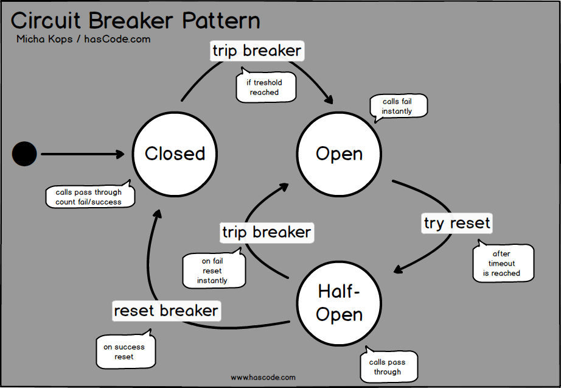
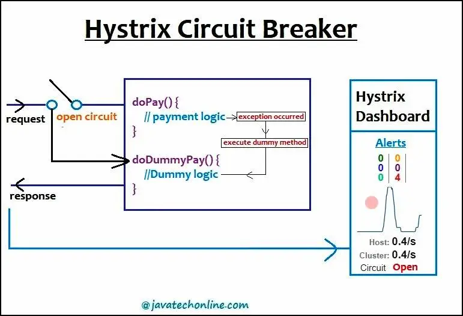

# Circuit Breaker Pattern

## 개요 

- Circuit Breaker Pattern은 분산 시스템에서 장애 상황을 다루기 위한 디자인 패턴이다. 
- 이 패턴은 장애가 발생했을 때 서비스 호출을 중단하고, 이전에 실패한 요청에 대한 응답을 즉시 반환하거나, 새로운 요청을 지연시키는 등의 방법으로 시스템에 대한 과부하를 방지한다.
- Circuit Breaker Pattern은 분산 시스템에서 장애가 발생하는 경우에 전체 시스템의 부하를 줄이기 위해 일시적으로 연결을 차단하는 디자인 패턴이다.
- Circuit Breaker는 일종의 가상의 스위치로, 네트워크 호출과 같은 외부 종속성이 있는 작업을 수행하기 전에 상태를 확인한다.
- 만약 이전에 실패가 발생하여 일정 수준 이상의 오류가 발생한다면, Circuit Breaker는 장애 발생을 감지하고 서비스 호출을 차단한다.
  
## 예

- 대표적인 예로는 Netflix의 Hystrix가 있다. 
- Hystrix는 Netflix에서 개발한 Circuit Breaker 라이브러리로, 여러분산 서비스에서 사용할 수 있다.

## Hystrix 기능 

- 요청이 실패할 경우 지정된 fallback 로직을 실행
- Circuit Breaker 를 사용하여 지정된 실패율 이상일 경우 회로를 열어 빠른 실패를 유발시켜 오버로드를 방지
- 백오프 로직을 사용하여 실패한 요청에 대해 지연을 추가하고, 시스템에 대한 과부하를 방지

## 베스트 프랙티스 

- 적절한 실패율 및 타임아웃 값을 설정하여 Circuit Breaker를 적절하게 동작시킨다.
- Circuit Breaker를 사용하는 경우 fallback 로직을 구현하여 대체 로직을 처리할 수 있도록 한다.
- Circuit Breaker가 열린 경우에 대한 경고 및 모니터링을 설정하여 문제를 신속하게 파악하고 대처한다.
- 회복 후에 Circuit Breaker를 자동으로 재설정할 수 있도록 한다
- 기본적으로 오류 수준에 따라 차단해야 할 서비스를 결정해야한다.
- 차단 및 재시도 정책은 애플리케이션에 맞게 조정필요

## 아키텍처



from: https://www.hascode.com/2017/02/resilient-architecture-circuit-breakers-for-java-hystrix-vert-x-javaslang-and-failsafe-examples/

- Closed: 서킷 브레이커는 처음에는 close되어 있다. (정상적인 상태)
- Open: 장애 등 설정된 이벤트가 일정 임계값을 넘으면 Circuit이 Open 된다. (장애로 서비스 요청이 차단된 상태)
- Half-Open: 서킷이 Open된 경우 일정시간 혹은 서비가 특정 임계 rate로 수행되는경우 Half-Open 상태로 전환된다. 
- Half-Open: 상태에서 더이상 문제가 발생하지 않으면 다시 Close 상태로 전이된다. 

## Hystrix Fallback 예제 



from: https://javatechonline.com/how-to-implement-hystrix-circuit-breaker-in-microservices-application/

- 요청이 doPay()로 전달되고 작업 처리를 수행한다. 
- 장애로 인해 circuit이 open되면 doPay()의 FallBack(대안프로세스) 으로 요청이 전환된다. 
- fallback인 doDummyPay() 는 더미 데이터 반환 처리를 수행하여, 장애 상황에 대한 대안 서비스를 수행하여, 안정적인 서비스를 유지한다. 
- hystrix 는 dashboard를 제공하며, 각 지점의 circuit 상태와 처리 rate를 확인할 수 있다. 

## 대표 솔루션

- Hystrix :
  - https://netflixtechblog.com/introducing-hystrix-for-resilience-engineering-13531c1ab362
- Resilience4j
  - https://resilience4j.readme.io/
  
```java
Supplier<String> supplier = () -> service.sayHelloWorld(param1);

String result = Decorators.ofSupplier(supplier)
  .withBulkhead(Bulkhead.ofDefaults("name"))
  .withCircuitBreaker(CircuitBreaker.ofDefaults("name"))
  .withRetry(Retry.ofDefaults("name"))
  .withFallback(asList(CallNotPermittedException.class, BulkheadFullException.class),  
      throwable -> "Hello from fallback")
  .get()
```

- Relillience4j 는 Decorator Pattern을 사용하여 기존 소스에 데코레이터 형식으로 CircuitBreaker를 적용할 수 있다. 

## WrapUp

- CircuitBreaker는 서버의 장애 상황에 따라 요청을 컨트롤 하는 솔루션이다. 
- 장애가 발생하면 Circuit이 Open이 된다. 
- Open 된 상태에서 복구되면 Circuit Close가 된다. 
- 다양한 Circuit Breaker Solution이 있으며, 스타일 및 적용방법에 따라 선택하면 된다. 
