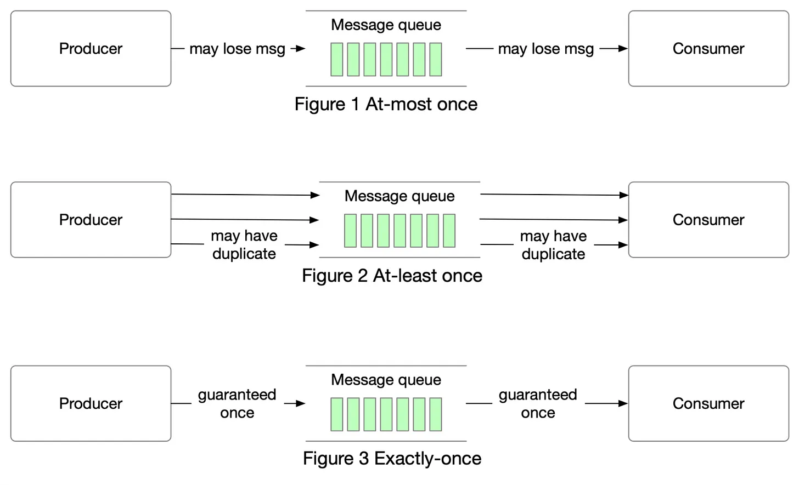
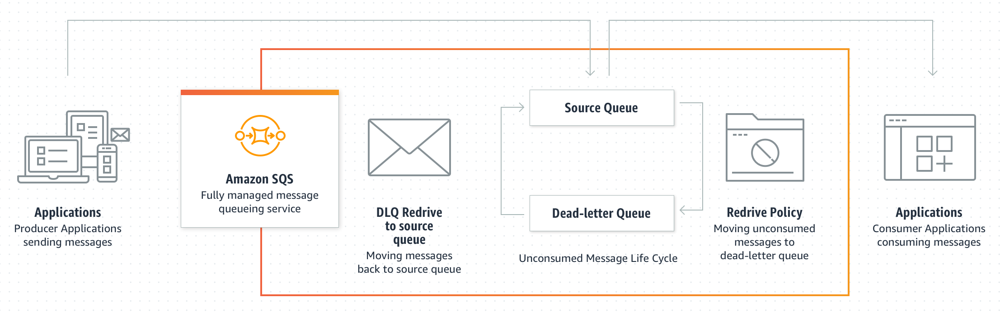

# Dead Letter Queue Pattern

## 개요 

- Dead Letter Queue Pattern (DLQ)은 메시지 브로커에서 메시지 처리 실패 시 해당 메시지를 재처리할 수 있도록 대기시켜놓는 큐이다. 
- 이 패턴은 분산 시스템에서 메시지 처리 중 발생할 수 있는 장애나 에러를 처리하는 데에 유용하다.

## 예

- 메시지 브로커에서 메시지를 처리하는 도중 해당 메시지를 처리할 수 없는 경우 해당 메시지는 DLQ로 이동된다. 
- 그 후, DLQ에서 해당 메시지를 재처리할 수 있다. 이러한 방식으로, 장애가 발생했을 때 해당 메시지를 유실하지 않고 다시 처리할 수 있도록 보장할 수 있다.

- 대표적인 예시로는 아마존 SQS (Simple Queue Service)에서 DLQ를 사용할 수 있다. 베스트 프랙티스로는, DLQ에서 메시지 처리가 반복해서 실패하는 경우에는 사람의 개입이 필요할 수 있으므로, 이러한 상황에 대비하여 모니터링 도구를 이용하여 관련 인원에게 알림을 보내는 것이 좋다. 
- 또한, DLQ에서 메시지를 재처리할 때는 메시지의 원인에 대한 분석이 필요하며, 해당 원인에 대한 수정 작업을 수행해야 한다.

## DLQ 배경 

- 일반적으로 메시지 브로커나 메시징 시스템에서 메시지를 처리하다가 예기치 못한 에러가 발생하거나 메시지를 처리할 수 없는 상황이 발생할 수 있다.
- 이러한 상황에서 메시지는 일반적으로 버려지기 때문에 해당 메시지를 재처리할 수 있는 기회를 잃게 된다. 
- DLQ 패턴은 이러한 메시지를 버리지 않고 다시 처리할 수 있도록 하기 위해 따로 큐를 두어 해당 메시지를 보관하는 것

## 고려할점 

- 적절한 재시도 횟수와 타임아웃을 설정하여 재시도가 가능한 문제에 대해 자동으로 처리하도록 구성한다.
- DLQ를 사용하여 에러가 발생한 메시지를 저장할 때, 메시지에 대한 정보(메시지 ID, 에러 내용 등)를 함께 저장하여 추후에 분석이 용이하도록 한다.
- DLQ를 모니터링하여 재처리해야 하는 메시지의 양을 파악하고 문제를 해결한다.
- DLQ에 존재하는 메시지의 경우 Stale(너무 오래됨) 할 수 있으며, 오래된 메시지에 대한 처리 방안도 고려해야한다. 
- Queue 메시지는 멱등성을 고려한 설계가 필요하다. 
- 메시지 신뢰성 고려 At most once, At least once, Exactly once 

### 메시지 신뢰성 

from: https://blog.bytebytego.com/p/at-most-once-at-least-once-exactly

- At most once:
  - 최대 한번만 전달
  - 메시지는 한번만 전달한다. 이 경우 메시지는 유실될 수 있다는 것을 가전한다. 
  - 메시지 로깅등과 같이 유실되어도 큰 문제가 없으며, 메인 시스템에 영향을 주지 않아야하는 경우 필요 
- At least once:
  - 적어도 한번은 전달
  - 메시지 손실이 없어야하며, 한번 이상도 전달될 수 있는 경우이다. 
  - 메시지가 재전송 될 수 있으므로 멱등성에 대한 대응책이 반드시 필요하다. 
- Exactly once:
  - 정확히 한번만 전달한다.
  - 메시지가 오직 1번 정확히 전달해야하는 경우에 사용한다. 
  - producer관점: 정확히 1번 전달하는 방법 (idempotent option in kafka)
  - consumer관점: 수동 commit로 메시지 처리가 완료 되어야 queue에서 메시지 삭제 될 수 있도록처리 (not auto commit)
  
## Architecture

from: https://docs.aws.amazon.com/ko_kr/AWSSimpleQueueService/latest/SQSDeveloperGuide/sqs-dead-letter-queues.html

- 이벤트 메시지는 정상적으로 Queue에 인입된다.
- 그러나 처리가 올바로 수행되지 못한경우 DLQ로 떨어지게 되낟. 
- DLQ를 모니터링 하다가 재시도가 필요한 대상은 DLQ에서 메시지를 찾아 요청을 재 실행한다. 

## WrapUp

- Deadletter Queue 는 전달되지 못한 메시지가 저장되는 큐이다. 
- Deadletter Queue에 들어있는 메시지는 모니터링 되다가, 필요한 전략에 따라 재시도 및 폐기를 수행한다. 
- 일반적인 Queue는 대부분 DLQ를 두어, 신뢰성 있는 메시지 전달을 수행한다. 
