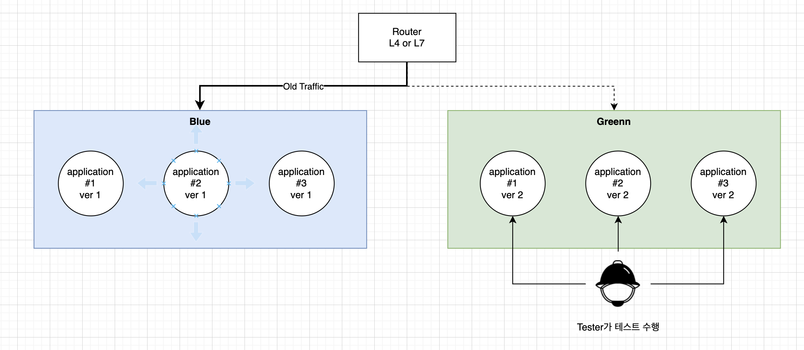
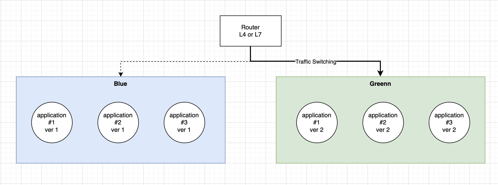

# Blue-Green Deploy Pattern

## 개요

- Blue-Green Deploy Pattern은 새로운 버전의 애플리케이션을 배포하기 전에, 이전 버전의 애플리케이션이 완전히 대체될 때까지 새로운 버전의 애플리케이션과 함께 운영하는 배포 전략이다.
- 이전 버전의 애플리케이션을 Blue, 새로운 버전의 애플리케이션을 Green으로 나타내어 사용한다. 
- 새로운 버전의 애플리케이션은 별도의 환경에서 배포되고, 이전 버전의 애플리케이션과는 별도의 네트워크 연결로 구성됩니다. 이후, 라우팅 규칙을 변경하여 이전 버전의 애플리케이션에서 새로운 버전의 애플리케이션으로 트래픽을 전환한다.
- 배포를 위해 그린 환경에 새로운 애플리케이션 버전이 설치되면, 라우터는 블루에서 그린 환경으로 전환한다.
- 라우터가 새로운 환경으로 라우팅되도록 구성하여, 새로운 버전의 애플리케이션을 라이브 환경으로 배포하고 기존 버전과 동시에 운영할 수 있다.

## 장점

- 롤백이 쉽다: 
  - 이전 버전의 애플리케이션을 쉽게 되돌릴 수 있다.
- 제로 다운타임: 
  - 이전 버전의 애플리케이션에서 새로운 버전의 애플리케이션으로 전환하는 동안 downtime이 발생하지 않는다.
- 높은 안정성: 
  - 새로운 버전의 애플리케이션을 완전히 배포하기 전에 안정성을 테스트할 수 있다.
- 확장성: 
  - 새로운 버전의 애플리케이션과 이전 버전의 애플리케이션을 함께 운영하므로, 스케일 업/다운을 자유롭게 수행할 수 있다.

## 예

- Blue-Green Deploy Pattern의 대표적인 예로는 AWS Elastic Beanstalk, Kubernetes, Cloud Foundry 등이 있다.

## 베스트프랙티스 

- 적절한 크기의 리소스: 
  - 새로운 버전의 애플리케이션에 충분한 리소스를 할당해야 한다.
- 철저한 테스트: 
  - 새로운 버전의 애플리케이션에 대한 테스트가 완료된 후에만 전환을 수행해야 한다.
- 운영 중인 시스템 모니터링: 
  - 새로운 버전의 애플리케이션이 충분한 안정성을 보장할 때까지 이전 버전의 애플리케이션과 함께 운영해야 한다.
- 그린 환경에서 검증
  - 그린 환경에 배포한 후 전체를 검증한 후 트래픽 전환

## Architecture

### Old System (Blue 활성화)

- Router는 Blue로 트래픽이 전송되고 있음 
- Blue는 기존 수행되고 있는 시스템을 말한다. 
- 새로운 버젼을 배포하기 위해서 Green 영역에 Blue와 동일한 크기의 시스템으로 배포를 수행한다. 
- Green 시스템은 내부에서 접근하여, 변경에 대한 테스트를 수행한다. 

### New System (Green 활성화)

- 테스트가 통과하면 트래픽을 Green으로 전환하고 실제 요청을 받아 들인다. 
- 일정 시간동안 모니터링을 수행한다. 
  - 모니터링 결과 정상:
    - Blue 시스템의 리소스를 릴리즈 한다. 
  - 모니터링 결과 실패:
    - Blue 시스템으로 라우팅을 롤백한다. 
    - 문제점을 Green에서 확인하고, 버그를 수정한후 배포 과정을 다시 반복한다. 

## WrapUp

- Blue/Green 배포는 과거시스템(Blue) 에서 신규시스템(Green)으로 트래픽 전환 방식으로 배포를 수행한다. 
- 배포가 완료되고 안정성이 확인되면 Blue를 제거한다. 
- 안정성이 불확실하거나, 실패하면 다시 트래픽을 Blue로 롤백한다. 