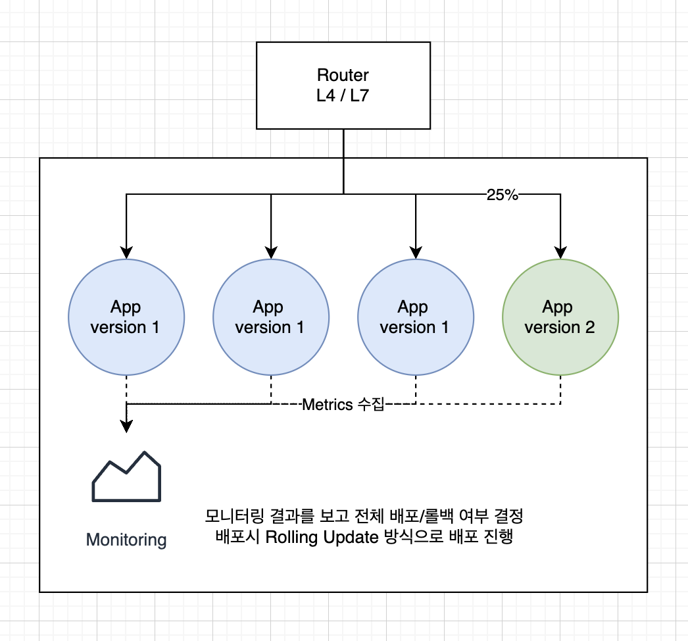

# Canary Release Pattern

## 개요

- Canary Release Pattern은 새로운 소프트웨어 버전을 일부 사용자에게 노출하고 이전 버전과 새 버전을 동시에 실행하여 새 버전의 안정성을 테스트하는 배포 전략이다. 
- 이러한 방식으로 새로운 버전이 전체 시스템에 대해 충분히 검증될 때까지 전체 사용자에게 배포되지 않도록 보호한다.
- 로운 버전의 소프트웨어를 일부 사용자들에게 배포하여 성능, 안정성 및 사용자 반응을 테스트하고, 전체 서비스에 배포하기 전에 문제점을 미리 예방하는 소프트웨어 배포 방식
  
## 예

- 대표적인 예시로는 Google, Netflix, Amazon 등의 대규모 서비스가 있다. 
- 이러한 서비스는 새로운 버전을 출시하기 전에 일부 사용자에게 노출시켜 먼저 새 버전의 안정성과 성능을 테스트하며, 이후 모든 사용자에게 적용한다.

## 베스트 프랙티스

- 적은 비율로 새로운 버전을 출시: 
  - 대개 5% ~ 10%의 비율로 새로운 버전을 노출시키는 것이 권장
- 모니터링 및 측정: 
  - 새로운 버전의 성능 및 안정성을 측정하고 모니터링하여 출시 가능 여부를 결정
- 롤백 계획: 
  - 새로운 버전의 문제 발생 시 신속하게 롤백할 수 있는 계획을 마련
- 환경 분리: 
  - 새로운 버전을 배포할 때, 새로운 환경에 배포하여 충돌을 방지
- 자동화된 배포 프로세스: 
  - 배포 프로세스를 자동화하여 인간의 오류를 최소화하고 안정성을 높인다.
- 충분한 사용자 그룹 선택: 
  - 충분한 수의 사용자 그룹을 선택하여 일부 사용자들이 새로운 버전을 사용하도록 한다. 
  - 사용자 범위 테스트를 충분히 수행할 수 있다. 

## 장점

- 사용자 트래픽의 일부를 실제로 수신받아 안정성 검증을 국소적으로 할 수 있다. 
- 문제 발생시 롤백을 바로하고, 작은 규모의 보정 작업을 수행할 수 있다. 
- 모니터링을 바탕으로 전체배포/롤백 전략을 구사할 수 있다. 

## 아키텍처 

- 위 도식에서 보는바와 같이 version2는 canary 로 배포 된다. 
- canary application은 대략 25% 정도의 실 사용자 트래픽을 수신 받는다. 
- 모니터링 시스템은 각 애플리케이션의 메트릭 정보를 수집하고, 신규 배포 버젼의 신뢰성을 검토한다.
- 이후 자동 혹은 수동으로 전체 배포를 수행한다. 
- 배포시에는 Rolling update 방식으로 일부를 배포한다. 
- 모니터링 결과가 좋지 않은경우 Rollback 을 수행하거나, 혹은 Traffic을 끊고 시스템에 접속하여 문제를 파악하고, 오류를 수정한다. 
- 잘못된 데이터는 전체의 25% 이내의 영역에서만 수정하면 된다. 

## WrapUp

- Canary 배포는 전체 배포를 한번에 수행하지 않고, 신규 어플리케이션의 일부만 실제 시스템에 배포한다. 
- 트래픽의 일부만 신규 애플리케이션으로 유입되고, 이 유입된 결과를 바탕으로 기존 대비 오류율등을 파악하고, 이 결과에 따라 배포/롤백을 결정한다. 
- 롤백 전략은 다양하며, 시스템의 니즈에 맞게 구사하면 된다. 

