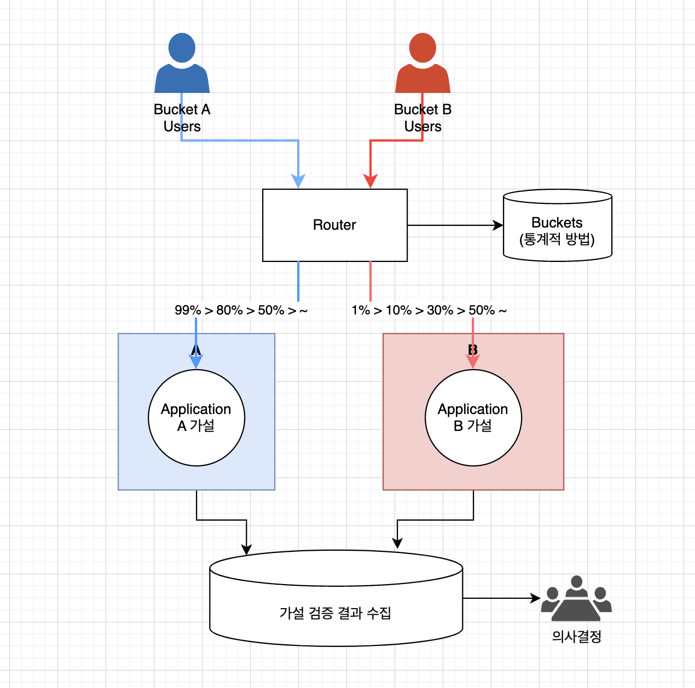

# A/B Test Deploy Pattern

## 개요

- A/B Test Deploy Pattern은 새로운 기능을 출시하기 전에 사용자들에게 서로 다른 버전을 제공하여 각 버전의 사용자 반응을 비교 분석하고, 최종적으로 더 나은 성능을 내는 버전을 선택하는 방법론이다. 
- 이를 통해 사용자들이 기능을 경험하는 방법, 사용자 반응, 성능 등을 테스트하여 더 나은 결정을 내릴 수 있다.
- 주로 사용자의 행위에 대한 가설을 설정하고, 이 가설에 대한 실험으로 A/B 테스트를 수행한다. 이후 수행 결과를 바탕으로 의사결정하는 용도로 사용된다. 
- 혹은 A/B 테스트의 트래픽 비율 조정을 통해서 배포 전략으로도 사용할 수 있다. 

## 예

- 대표적인 예로는 웹사이트의 랜딩 페이지에서, 버튼, 배너, 이미지 등을 변경하여 각각의 페이지를 특정 사용자 그룹에게 제공하고, 그 결과를 비교 분석하여 최종적으로 더 나은 페이지를 선택하는 것이 있다.
- 주로 고객 UI 영역에 대한 가설 검증용으로 사용된다. 

## 베스트 프랙티스 

- 대상선정:
  - A/B 테스트에서 사용할 대상을 정하는 것이 중요하다. 
  - 일부 사용자에게만 제공되는 기능을 테스트하거나, 다수의 사용자에게 영향을 미치는 기능의 경우, 대상 그룹을 신중하게 선택해야 한다. 
- 충분한 검증 시간:
  - 충분한 시간을 투자하여 랜덤화된 사용자 집단에게 제공하는 것이 중요하다. 
- 데이터기반 의사결정 정보 활용:
  - A/B 테스트의 결과를 정량적, 정성적으로 분석하여 결정을 내리는 것이 좋다. 
  - 이를 통해 사용자 경험과 성능을 개선하고, 최종적으로 비즈니스 성과를 향상시킬 수 있다.

## 장점

- A/B 테스트를 통해 단순히 기획자 개인의 의견으로 의사결정하는 것을 방지할 수 있다. 
- 데이터 기반 의사결정 수행이 가능하다. 
- 가설, 실험, 데이터 분석의 과정으로 모두가 인지하는 결론에 도달할 수 있다. 
- 가설을 배포한 경우 문제 발생시 트래픽 Rate를 조절하여 이전 상태로 빠르게 돌릴 수 있다. 

## 아키텍처

- 가설을 설정하고, 가설에 따라 A/B 서비스를 배포한다. 
- 사용자를 A bucket / B bucket으로 분류하고, A/B 로 트래픽을 분산한다.
- 한번 버킷이 설정되면 항상 동일한 서비스로 연결된다. 이것이 버킷의 용도이다. 
- 사용자의 행위를 분석하여 데이터를 수집한다. (가설 검증 결과 수집)
- 수집된 결과를 분석하고, 의사결정 데이터로 활용한다. 
- 참고로 트래픽은 A > B로 점차 늘여가거나, B > A로 점차 줄여서 원래대로 돌릴수도 있다. 

## WrapUp

- A/B 테스트는 가설, 가설검증을 통해서 의사결정을 하기 위한 전략이다. 
- 한번 설정된 버킷에 따라 사용자는 같은 UI를 보게 되고, 이에 따라 사용자의 패턴을 분석한다. 
- 데이터 기반으로 의사결정을 할 수 있는 수단이다. 
- 또한 배포시에도 A > B로 트래픽을 늘려가며 전략적인 배포용도로도 사용할 수 있다. 
