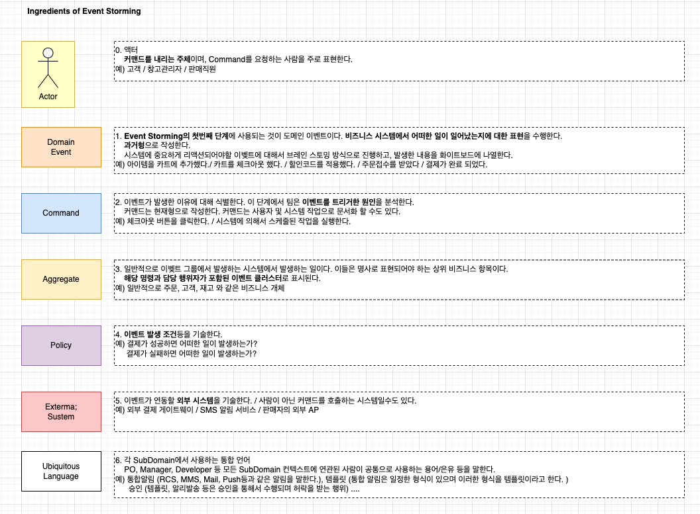
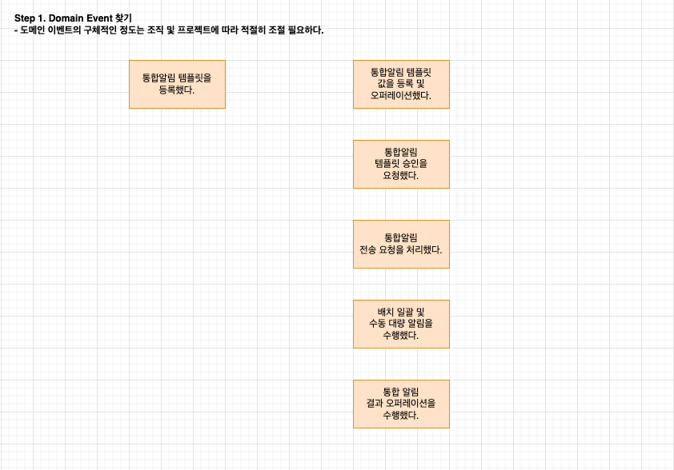
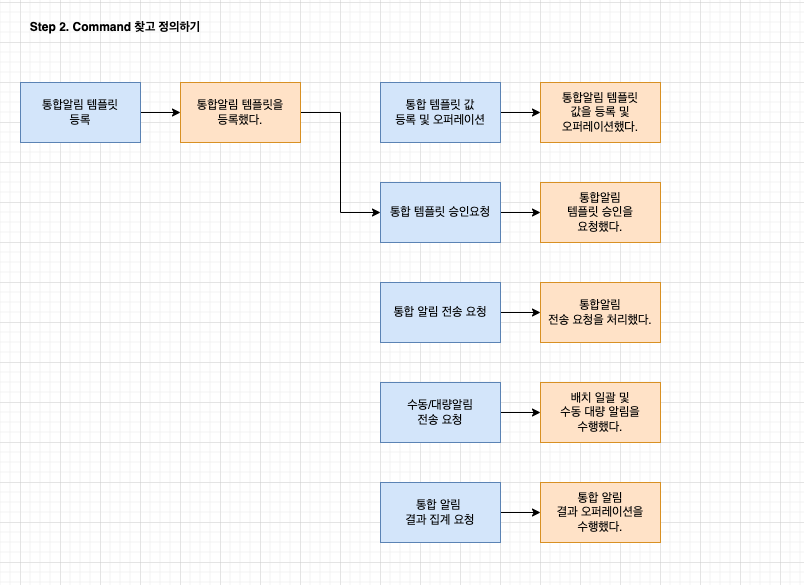
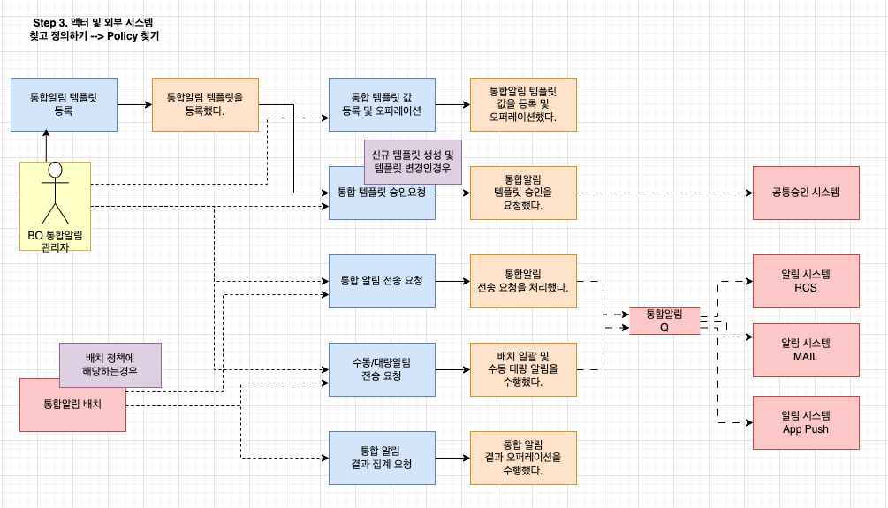
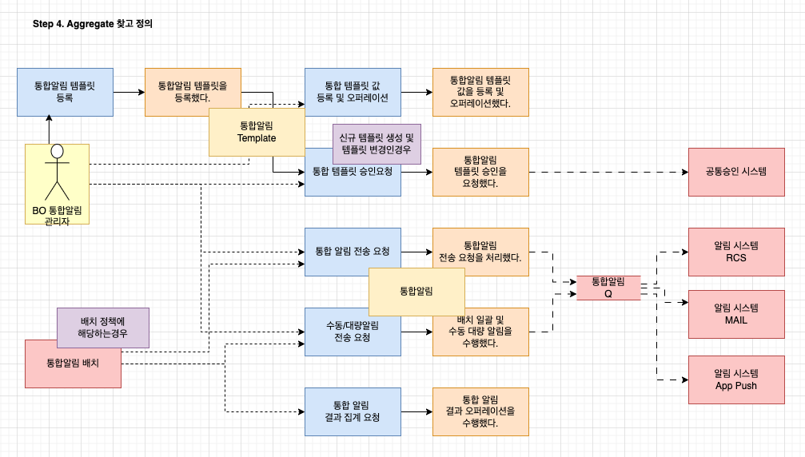
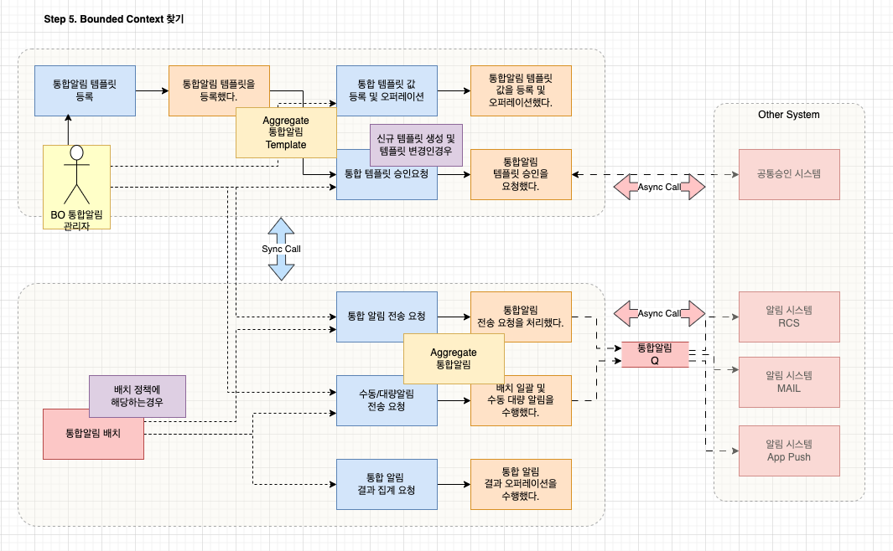

# Event Storming 이해

## 개요

- 비즈니스 요구사항을 정의하는 다양한 방법이 있음 
  - 유저스토리, 제품 비젼 캔바스, 사용자 저니맵 등
- 막상 개발을 하는 개발자에게는 괘리감이 있는 접근방식으로 Event Storming은 이를 보완할 수 있는 도구이다. 
- 또한 과거 소프트웨어 아키텍처는 데이터 구조와 객체의 상태에 기반을 두었다. 이것은 현실세계의 비지니스를 충족하기에 맞지않는 부분이 많다. 

## Event Storming 기본

- 이벤트 스토밍은 소프트웨어 프로그램의 도메인에 어떠한 일이 수행되는를 찾아내는 워크샵 기반의 방법이다. 
- 즉 도메인에서 발생하는 이벤트로 시작해서 도메인 영역을 구성해 가는 과정이다. 
- DDD(Domain Driven Design) 을 근간으로 하고 있으나 DDD에 대해서 몰라도 상관없다. 

## Event Storming 사용이유

- 비즈니스 모델 관점에서 제품환경, 비즈니스 요구사항, 목표에 대한 큰 그림을 바탕으로 접근 
- 워크샵을 통해 활동적이고 재미있는 방법으로 디자인 수행 
- 이벤트 스토밍을 수행하는 과정에서 구체적인 솔루션 파악 가능 
- 이벤트스토밍은 성숙한 제품을 보유한 팀이 프로세스를 만들고, 병목현상 및 충돌 영역을 찾는데 유용할 수 있다. 

 

## 이벤트 스토밍이 비즈니스 관점에 유용한 이유

- 개발자 뿐만 아니라 프로젝트에 연관된 스테이크 홀더 모두의 이해를 증진 시킬 수 있다. 
- 워크샵을 통해서 비즈니스 도메인에 대해서 개발자들이 더욱 잘 이해할 수 있다. 
- 초기분석이 더 정교하면, 구현을 위한 단계에 더 집중하게 된다. 
- 이는 구축 중인 제품의 일반적인 품질뿐만 아니라 비즈니스 팀과 개발 팀 간의 전반적인 협력에도 적접 영향을 준다.

 

- 이벤트 스토밍 세션중에 그룹은 도메인의 작은 조각을 추출하고 토론할 기회를 가진다.
- 처음에 복잡성이 적을수록 제품 개발이 진행됨에 따라 문제가 덜 복잡해진다. 

## 이벤트 스토밍 가이드 (어떻게 수행하는가?)

### 사람 조직화하기

- 성공적인 이벤트 스토밍 세션의 키는 자신의 전문분야를 잘 아는 많은 사람을 모으는 것이다. 
  - 비즈니스 익스퍼트
  - 개발 익스퍼트
  - 기획, QA등 관련 스테이크 홀더 참여 
- 개발자들은 어떠한 일이 일어날 수 있는지를 질문하고, 이러한 질문에 대한 답변을 할 수 있는 비즈니스 전문가가 필요하다
- 이벤트, 명령을 탐색하고 집계로 그룹화하는 프로세스를 안내하는 조력자도 필요

### 작업공간 구성하기

- 가장 중요한 것은 제한이 없는 모델링 공간을 제공하는 것이다. (넓은 칠판과 매우긴 종이 조각이 필요하다)
- 몇개의 색상을 가진 포스트잇, 마커, 그리고 테이프와 최종적으로 좋은 환경(공기)이 필요하다. 
  - 오렌지: 도메인 이벤트
  - 파랑: 커맨드 (이벤트를 발생시키는 명령에 해당)
  - 노랑: 액터 (이벤트를 발생시키는 주체)
  - 주황: 어그리거트 (도메인 내 핵심 객체)
  - 보라: 정책 (이벤트가 발생하는 조건)
  - 빨랑: 외부 시스템
#### 다시한번 충분한 모델링 공간 확인하기

- 이벤트 스토밍을 수행하기 위한 충분한 공간이 남아있는지 계속해서 트래킹하고 정리하기 
- 참가자의 진행 흐름을 끊지 않도록 조력자 활동 필요 

#### 앉아 있길 원하는가? 그렇게 하지마라

- 세션 시간동안 모든 테이블과 의자는 제거
- 작은 테이블: 커피머그 놓거나, 스티커에 글을 쓰기 위한 장소

### 워크샵 진행 단계

#### Step 0 - (Event Storming) 구성요소들 

#### Step 1 - domain events

- 처음에는 도메인 이벤트를 마구마구 발표하고 벽에 붙이는 단계
- 비즈니스 도메인의 맥락에서 '무슨 일이 있었는지' 라는 질문에 답하기 위해 노력하기

 

- 조력자는 다른 모든 사람들을 격려하기 위해 도메인 이벤트가 포함된 첫 번째 포스트잇을 추가한다.
- 그런 다음 그룹은 실제 일정에 초점을 맞추지 않고 아이디어를 '스토밍' 하기.
- 참가자 중 일부는 비즈니스 프로세스의 시작과 끝을 표시하는 이벤트를 정의하는 것이 사람들이 더 쉽게 계속 할 수 있도록 도움이 될 수 있다.

 

- 사건을 과거 시제로 기록하는 것을 잊지 않기
- 이는 참가자가 '무슨 일이 일어났는지' 측면에 집중하는 데 도움이 된다
- 이벤트를 기록하는 동안 참가자가 행동을 수행하는 행위자에게 집중해서는 안 된다는 점을 강조하는 것도 중요하다 (과정 후반에 이에 대한 장소가 있을것이다.)

#### Step 2 - commands 

- 왜 이런 일이 일어났는가?
- 이것은 우리가 다음 세션 블록을 시작한 질문이었고 이벤트를 연대순으로 정렬하기 시작하는 올바른 방법이다. 
- 이 단계에서는 명령이 비즈니스 영역에서 사람들이 할 수 있는 것임을 참가자들에게 지적하는 것과 관련이 있다. 

 

- 블록 끝에 도달하면 잠시 생각하면서 올바르게 수행하고 있는지 확인하기  
- 커맨드에서 시작하면 기능에 촛접이 맞춰짐
- 이벤트로 시작하면 도메인의 목표를 보다 명확하게 집중 가능 

 

- 이 시점에서 명령 및 기타 트리거를 추가하면 프로세스의 첫 번째 부분보다 더 많은 논의가 제기된다
- 사람들은 실제로 질문을 하고 무슨 일이 일어나야 하는지 생각하고 새로운 이벤트를 추가했다.
- 따라서 다음 워크숍에서는 확실히 그 단계에 조금 더 많은 시간을 할애할 것이다.

#### Step 3 - other triggers

- 이벤트는 명령에 뿌리를 두고 있을 수 있지만 사람, 시간, 문서 또는 외부 또는 계단식 이벤트에 의해 트리거될 수도 있다.
- 이 세션동안 이러한 추가 요소로 모델을 채웠다.
- 명령이 포함된 일부 스티커는 이제 외부 이벤트 또는 시간을 나타내는 메모로 대체할 수 있다..
- 피드백 세션에서 참가자들은 우리가 사용하려는 모든 유형의 트리거를 미리 알고 있으면 더 효과적이다.

#### Step 4 - aggregates

- 다음 스텝은 집계를 중심으로 이벤트와 명령을 그룹화 했다.
- 각 집계는 로컬 책임이 있는 특정 비즈니스 개념을 나타낸다. 

#### Step 5 - bounded context

- 연관된 도메인이벤트, 커맨드들을 같은/유사한 것끼리 묶어준다.
- aggregate에서 시간을 보내고 나면, ubiquitous language에 대해서 논의해야한다.
- 제품 개발에 참여하는 모든 사람들은 공유된 이해를 지원하기 위해 도메인 언어(워크숍, 요구사항, 코드등)을 말해야한다. 
- 이를 바탕으로 단어가 비즈니스 관점에서 다른 의미를 갖는 영역을 구분할 수 있어야한다.

 

- bounded context는 용어가 나타내는 설정으로 그 의미를 결정한다. 
- 각 컨텍스트는 명확한 경계가 있고 일관성이 있으며, 고유한 규칙이 있지만 여전히 다른 사용자와 통신한다. 

 

## 참고:

- 본문참고: https://www.boldare.com/blog/event-storming-guide/

- https://virtualddd.com/learning-ddd/awesome-eventstorming
- https://creately.com/blog/meeting-visual-collaboration/event-storming/
- https://alexalvess.medium.com/modeling-your-domain-with-event-storming-workshop-3da70c6b35f1
- https://ibm-cloud-architecture.github.io/refarch-eda/methodology/event-storming/
- https://www.amdocs.com/insights/blog/event-storming